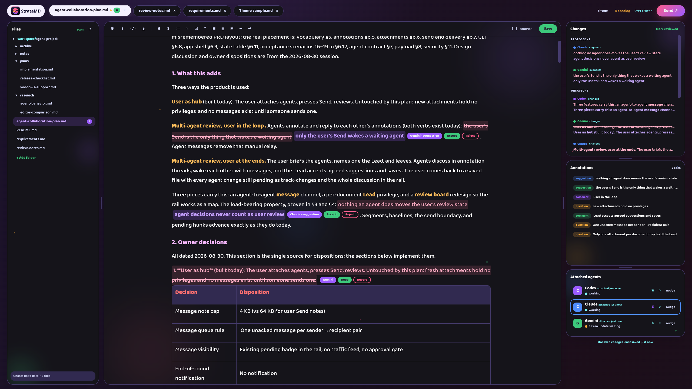
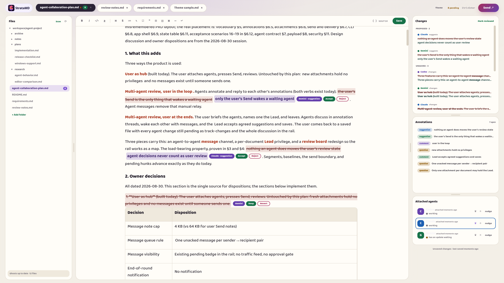
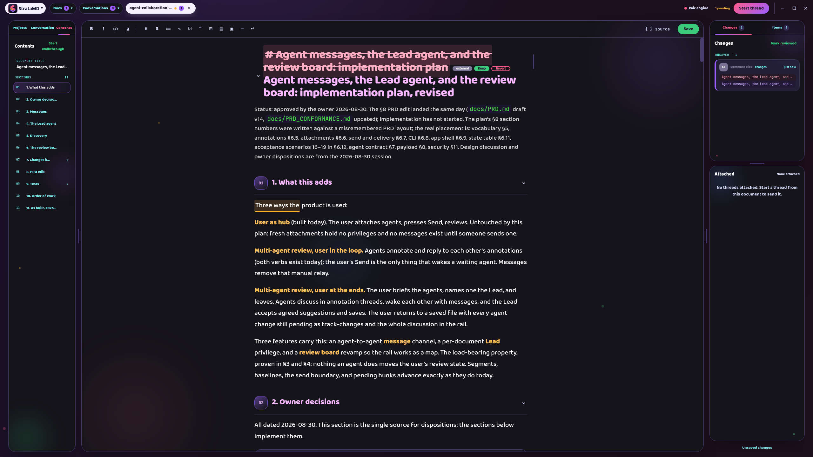
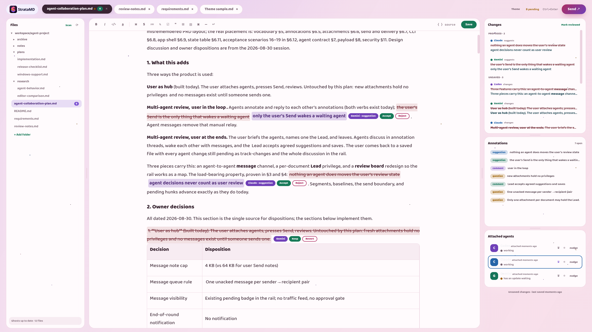
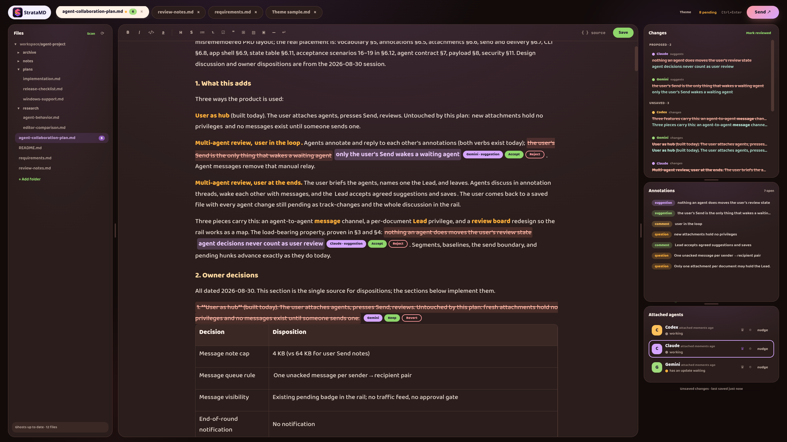
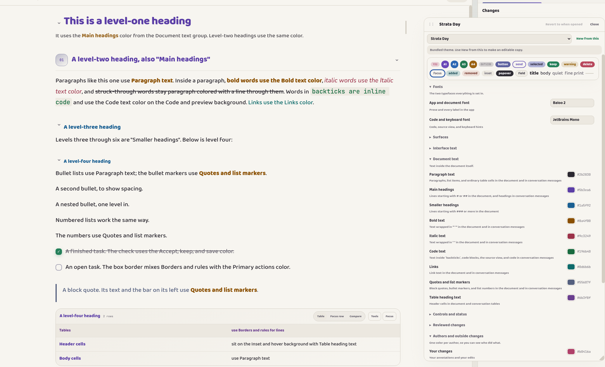
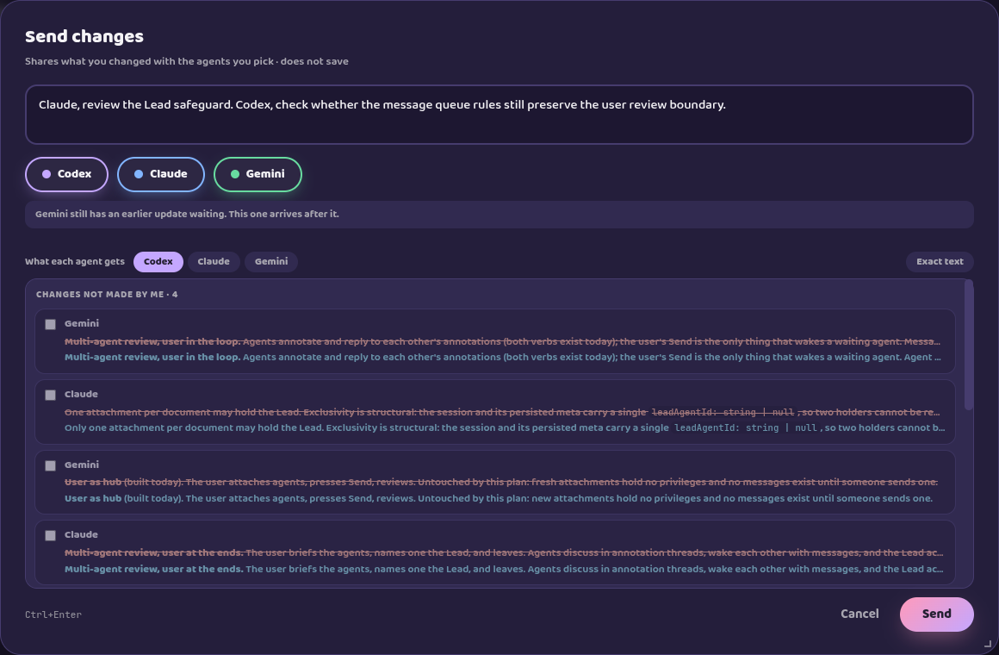
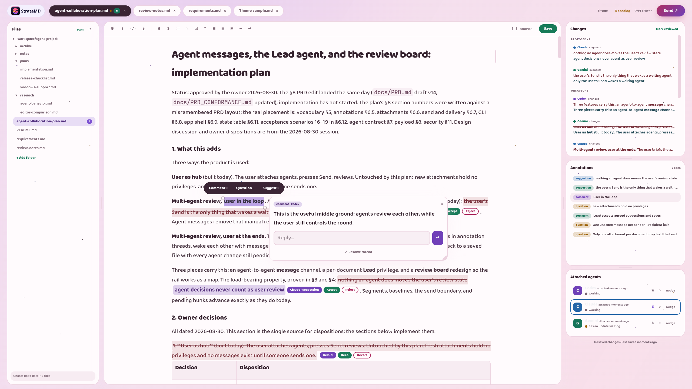
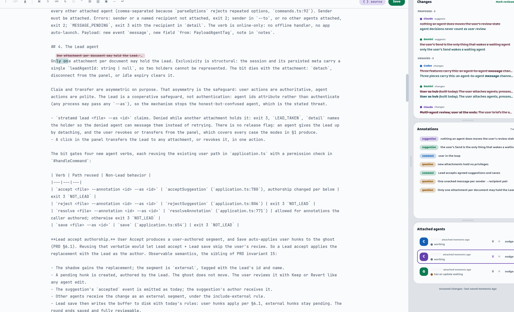

<p align="center">
  
</p>

<p align="center"><b>StrataMD makes reading what your agents write suck less.</b></p>

<p align="center">
  <a href="LICENSE"></a>
  
  
  
</p>


Markdown sucks to read! Built-in Markdown readers make it worse. But trusting an agent to write a good plan without checking it is a huge gamble.

Agents misunderstand requirements. They add architecture the project doesn't need, remove things nobody asked them to touch, and confidently plan around the wrong idea. The faster you can spot that, the less time you spend fixing mistakes.

**StrataMD** is a visual Markdown editor for people who work and plan with AI agents. It makes agent-written documents easier to skim, gives you a precise way to respond inside them, and lets the agents you already use join the document when you want them there.

[](docs/screenshots/product/states/hero-active-review.png)

*Screenshots open at their full captured resolution.*


## Markdown you can actually skim

Agent plans don't need to be read like a book. Most of the time, you just need to understand the structure, catch the parts that look obviously wrong, and stop the agent where they started to go wrong.

StrataMD renders rich Markdown instead of making you read Markdown syntax. Headings look like headings. Code, bold text, links, lists, tables, and quotes are easy to distinguish at a glance. That visual separation makes it much easier to keep your place and notice when something doesn't belong.

You can write and edit in the rendered document, then switch to source when the Markdown itself matters.


## Make it look like yours

There is no single visual theme that would make a document easy for everyone to scan. StrataMD gives you seven included themes, from plain paper-like layouts to much louder color palettes, and lets you use any of them as the starting point for your own.

| Paper | Strata Vivid |
|:---:|:---:|
| [](docs/screenshots/product/themes/paper-active-review.png) | [](docs/screenshots/product/themes/strata-vivid-active-review.png) |
| Candyfloss | Ember |
| [](docs/screenshots/product/themes/candyfloss-active-review.png) | [](docs/screenshots/product/themes/ember-active-review.png) |

The theme panel has separate controls for the document, the interface, changes, agent identities, and decorative effects. Forty color controls let you distinguish things such as large headings, small headings, bold text, code, links, quotes, table headings, and the different kinds of agent work. Text and code fonts are configurable separately.

Themes can also use separate background and panel effects chosen from eight options, including none, with adjustable speed and intensity.

Themes are plain JSON files. Copy an included theme, change a few values in the live panel, or ask an agent to inspect the active theme and help tune it while you watch the result.

[](docs/screenshots/product/states/theme-panel--workspace.png)


## Work with agents inside the document

StrataMD is not another AI chat client and does not have a model picker. It is a tool you use alongside your current workflow to improve it. Keep using Codex, Claude, or whichever agent already fits your workflow. If it can run a command on your machine, it can work with StrataMD.

Give the agent the bundled StrataMD skill once. After that, this is enough:

> Attach to the document I have open in Strata.

The agent joins the live document, including unsaved edits. The command details and full agent reference are in the [technical section](#agent-cli-reference).

When you skim a plan and find the point where the agent went wrong, select the relevant text. Leave a comment, ask a question, suggest a replacement, or make the small edit yourself. The agent receives your thought attached to the exact part of the document you meant. You do not have to spend context explaining which heading, paragraph, or bullet you are talking about.

Agents can answer with the same tools. Comments and questions stay attached to the text. Small proposed replacements return as suggestions with **Accept** and **Reject**. Larger edits appear as changes with **Keep** and **Revert**. Everything remains attributed, and none of this adds annotation data to the Markdown file itself.

### Send the change, not the whole conversation

The first time an agent attaches, it receives the complete live draft. After that, StrataMD remembers what that particular agent has already seen.

When you press **Send**, the preview shows the exact changes, notes, and annotation activity prepared for each recipient. StrataMD freezes that delivery before it leaves, so edits you make afterwards cannot slip into it. Two agents that joined at different points can each receive the context they need without repeatedly consuming the whole document.

[](docs/screenshots/product/states/send-preview--detail.png)


## Let agents work together

More than one agent can join the same document. Have Codex draft a plan and Claude review it, or the other way around. The reviewer can question an assumption, leave comments, and propose replacements directly where the problem appears. You decide which agents see one another's work, and their contributions stay separate and attributed.

Agents can also pass short notes to each other. When you want them to continue without waiting for you to referee every exchange, give one of them **Lead**. Only one agent can lead a document at a time. The Lead can accept or reject suggestions, resolve finished threads, coordinate the other agents, and save.

Lead does not make the work invisible. Decisions made by the Lead still appear as pending changes for you to review when you return. You can transfer Lead to another agent or take it back at any time.

[](docs/screenshots/product/states/collaboration.png)


## How to use StrataMD

```text
Open a Markdown file
        ↓
Ask your agent to attach
        ↓
Read, edit, and annotate in StrataMD
        ↓
Send the changes you want the agent to see
        ↓
The agent comments, suggests, or edits
        ↓
Review the work, continue the round, or save
```

1. Open a `.md` file in StrataMD.
2. Ask an agent to attach to the document you have open.
3. Skim the document, edit it, and leave annotations where you want the agent's attention.
4. Press **Send** when you want the agent to continue.
5. Accept or reject suggestions, and keep or revert larger edits.
6. Save when the document is ready.

**Send** and **Save** are separate actions. Sending gives an agent its next round of context. It does not write the document to disk.


## How it works

### Any shell-capable agent can join

StrataMD uses a small local command-line tool instead of embedding a model or building a separate integration for every chat app. The bundled [StrataMD skill](skills/stratamd/SKILL.md) teaches an agent when to attach and how to stay in the editing loop. `stratamd --agent-help` prints the current protocol whenever the agent needs it.

The agent attaches to the focused document, so you do not need to find and paste a file path. StrataMD knows nothing about the model, provider, or chat interface on the other side of the command.

### The buffer protects the document

While a document is open, StrataMD mirrors the live editor into a private working buffer. Attached agents read and edit that buffer, including work you have not saved yet. The actual `.md` file does not change until you press **Save**.

StrataMD also keeps a **ghost**, which is the last version of the document you reviewed. It compares new work against that ghost to produce Keep and Revert changes. If an agent or another tool edits the Markdown file directly, StrataMD brings that edit into the same review flow, even when the file changed while StrataMD was closed.

The buffer, ghost, annotations, and pending deliveries live in StrataMD's local app-data folder. They do not appear beside the Markdown files in your project. StrataMD itself makes no network requests. Attached agents handle document content according to the model provider and configuration you already use.

### Each kind of response has its own review path

| Agent response | What you see | Your choices |
|---|---|---|
| Comment or question | A thread attached to the quoted text | Reply or resolve |
| Suggested replacement | The original text and proposed Markdown | Accept or Reject |
| Direct buffer or file edit | An attributed change in the document and Changes panel | Keep or Revert |
| Lead decision | A change made during an agent-led round | Review when you return |

Annotations stay in StrataMD rather than being written into or beside the document. If the quoted text no longer exists and StrataMD cannot place an annotation safely, it refuses to guess.

### Untouched Markdown stays untouched

StrataMD edits CommonMark and GitHub Flavored Markdown in a rendered view, but it does not rewrite the parts you never touched. Those regions are saved from their original bytes. A Save with no document edits produces the same file byte for byte.

Markdown that the visual editor cannot safely represent, such as frontmatter, HTML, or reference definitions, remains protected as raw content and can be edited in source view. When something else changes the file on disk, StrataMD checks for conflicts before saving over it.

[](docs/screenshots/product/states/source-review--workspace.png)

### Agent CLI reference

<details>
<summary>Show every agent command</summary>

| Command | What it does |
|---|---|
| `stratamd attach [file]` | Joins the focused or named document and waits for the next delivery |
| `stratamd annotate` | Leaves a comment, question, or suggested replacement on quoted text |
| `stratamd reply` | Replies to an annotation thread |
| `stratamd send` | Sends a short note from one attached agent to another |
| `stratamd lead` | Claims Lead when the user puts that agent in charge |
| `stratamd accept` | Accepts a suggestion while acting as Lead |
| `stratamd reject` | Rejects a suggestion while acting as Lead |
| `stratamd resolve` | Closes a finished annotation thread |
| `stratamd save` | Saves while acting as Lead, with the result left pending for user review |
| `stratamd state` | Reads the current document, theme, attached agents, and Lead |
| `stratamd theme` | Describes a theme and its editable values |
| `stratamd changes` | Lists changes the user has not reviewed |
| `stratamd changed` | Attributes the agent's next direct edit |
| `stratamd open` | Opens a Markdown file with outside edits shown for review |
| `stratamd checkpoint` | Creates a reviewed baseline for a file or directory |
| `stratamd detach` | Leaves the document session |

`stratamd --agent-help` is the complete and current reference. The table above is the human-readable map, not a replacement for the instructions agents receive.

</details>


## Trying StrataMD

StrataMD currently builds from source on Linux. macOS and Windows support are planned, but they are not available yet.

If you want to try it, give your agent a link to this repository and ask it to install StrataMD and add the bundled skill. That is probably easier than walking through the setup yourself.

<details>
<summary>Manual Linux setup</summary>

StrataMD requires Node.js 22 or newer and pnpm.

```bash
pnpm install
pnpm build:linux
./dist/linux-unpacked/stratamd setup
stratamd open README.md
```

The setup command is safe to repeat. `stratamd setup --remove` removes the PATH link and desktop integration. For development, run `pnpm dev`.

</details>


## Why this exists

I built StrataMD because I spend a lot of time planning work with agents, and I was not reading enough of their plans. Markdown was miserable to read in the tools I had, so I skimmed less carefully and trusted the agent more. That caused problems. When I did read the plans, even a quick skim caught bad assumptions, unnecessary work, and places where the agent had misunderstood what I wanted.

I wanted an editor where the structure was obvious, the document could look the way I wanted, and responding to an agent did not require another long explanation in chat. StrataMD makes my own work better. If your workflow looks anything like mine, I think it's worth using.


## Project status

StrataMD is an early-stage personal project. There is no public package or auto-updater yet.

The [product specification](docs/PRD.md) contains the complete behavior, edge cases, and design decisions for anyone who wants to understand the implementation, contribute, or fork the project. The bundled [agent skill](skills/stratamd/SKILL.md) contains the collaboration loop from the agent's side.

Bug reports, questions, and opinions can go to <dillonc@sandflatllc.com>.


<p align="center">
  
</p>
