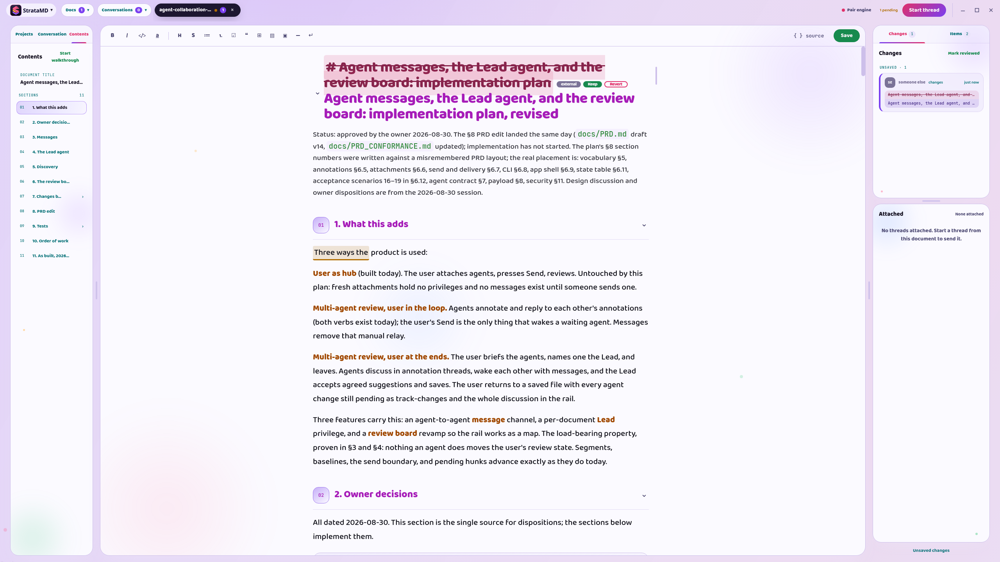
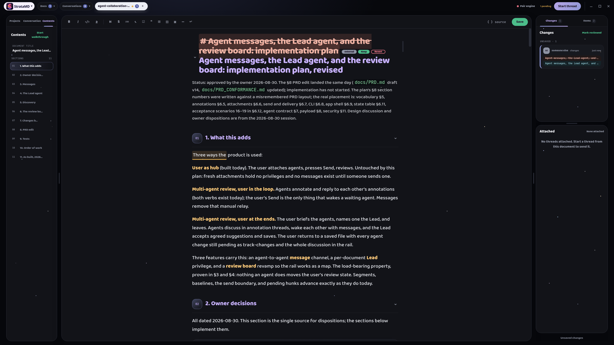
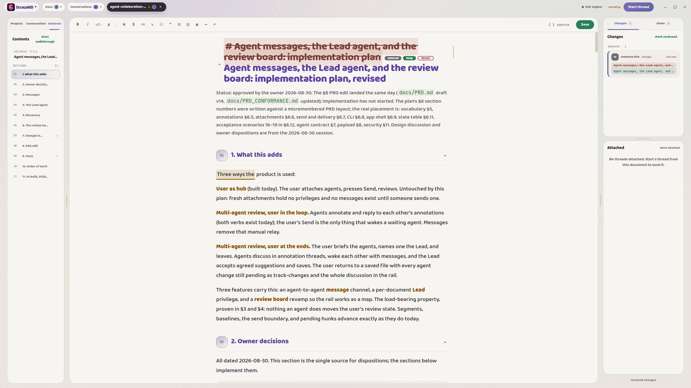

<p align="center">
  
</p>

<p align="center"><b>StrataMD makes reading what your agents write suck less.</b></p>

<p align="center">
  <a href="LICENSE"></a>
  
  
  
</p>


Markdown sucks to read! Built-in Markdown readers make it worse. But trusting an agent to write a good plan without checking it is a huge gamble.

Agents misunderstand requirements. They add architecture the project doesn't need, remove things nobody asked them to touch, and spend far too much time planning around the wrong idea. The faster you can spot that, the less time you spend fixing mistakes.

**StrataMD** is a visual Markdown editor for people who work and plan with AI agents. It makes agent-written documents easier to skim, gives you a precise way to respond inside them, and lets the agents you already use join the document when you want them there.

[](docs/screenshots/product/states/hero-active-review.png)


## Markdown you can actually skim

Agent plans don't need to be read like a book. Most of the time, you just need to understand the structure, catch the parts that look obviously wrong, and stop the agent where they started to go wrong.

StrataMD renders rich Markdown instead of making you read Markdown syntax. Headings look like headings. Code, bold text, links, lists, tables, and quotes are easy to distinguish at a glance. That visual separation makes it much easier to keep your place and notice when something doesn't belong.

You can write and edit in the rendered document, then switch to source when the Markdown itself matters.


## Make it look like yours

There is no single visual theme that would make a document easy for everyone to scan. StrataMD includes four themes, a vivid and a quiet one in both dark and light, and lets you use any of them as the starting point for your own. Every one of them gives each kind of document text its own color, because that is what makes a dense document scannable.

| Strata Vivid | Strata Vivid Light |
|:---:|:---:|
| [](docs/screenshots/product/themes/strata-vivid-active-review.png) | [](docs/screenshots/product/themes/strata-vivid-light-active-review.png) |
| Strata Night | Strata Day |
| [](docs/screenshots/product/themes/strata-night-active-review.png) | [](docs/screenshots/product/themes/strata-day-active-review.png) |

The theme panel has separate controls for the document, the interface, changes, agent identities, and decorative effects. Forty color controls let you distinguish things such as large headings, small headings, bold text, code, links, quotes, table headings, and the different kinds of agent work. Text and code fonts are configurable separately.

Themes can also use separate background and panel effects chosen from eight options, including none, with adjustable speed and intensity.

Themes are plain JSON files. Copy an included theme, change a few values in the live panel, or ask an agent to inspect the active theme and help tune it while you watch the result.

[](docs/screenshots/product/states/theme-panel--workspace.png)


## Work with agents inside the document

StrataMD is not another AI chat client and does not have a model picker. It is a tool you use alongside your current workflow to improve it. Keep using Codex, Claude, or whichever agent already fits your workflow. If it can run a command on your machine, it can work with StrataMD.

Give the agent the bundled StrataMD skill once (`stratamd setup --skill claude`, or [another harness](#giving-your-agent-the-skill)). After that, this is enough:

> Attach to the document I have open in Strata.

The agent joins the live document, including unsaved edits. The command details and full agent reference are in the [technical section](#agent-cli-reference).

When you skim a plan and find the point where the agent went wrong, select the relevant text. Leave a comment, ask a question, suggest a replacement, or make the small edit yourself. The agent receives your thought attached to the exact part of the document you meant. You do not have to spend context explaining which heading, paragraph, or bullet you are talking about.

Agents answer through their T3 reply and its final `strata` block. Comments and questions stay attached to the text. Small proposed replacements return as suggestions with **Accept** and **Reject**. Larger edits appear as changes with **Keep** and **Revert**. Everything remains attributed, and none of this adds item data to the Markdown file itself.

### Send the change, not the whole conversation

The first time an agent attaches, it receives the complete live draft. After that, StrataMD remembers what that particular agent has already seen.

When you press **Send**, the preview shows the exact changes, notes, and annotation activity prepared for each recipient. StrataMD freezes that delivery before it leaves, so edits you make afterwards cannot slip into it. Two agents that joined at different points can each receive the context they need without repeatedly consuming the whole document.

[](docs/screenshots/product/states/send-preview--detail.png)


## Let agents work together

More than one agent can join the same document. Have Codex draft a plan and Claude review it, or the other way around. The reviewer can question an assumption, leave comments, and propose replacements directly where the problem appears. You decide which agents see one another's work, and their contributions stay separate and attributed.

When you want work to continue without waiting for you to referee every action, give one attached thread **Lead**. Only one thread can lead a document at a time. The Lead can accept or reject suggestions, resolve finished items, coordinate the work, and save.

Lead does not make the work invisible. Decisions made by the Lead still appear as pending changes for you to review when you return. You can transfer Lead to another agent or take it back at any time.

[](docs/screenshots/product/states/collaboration.png)


## How to use StrataMD

```text
Open a Markdown file
        ↓
Ask your agent to attach
        ↓
Read, edit, and annotate in StrataMD
        ↓
Send the changes you want the agent to see
        ↓
The agent comments, suggests, or edits
        ↓
Review the work, continue the round, or save
```

1. Open a `.md` file in StrataMD.
2. Ask an agent to attach to the document you have open.
3. Skim the document, edit it, and leave annotations where you want the agent's attention.
4. Press **Send** when you want the agent to continue.
5. Accept or reject suggestions, and keep or revert larger edits.
6. Save when the document is ready.

**Send** and **Save** are separate actions. Sending gives an agent its next round of context. It does not write the document to disk.


## How it works

### Any shell-capable agent can join

StrataMD uses a small local command-line tool instead of embedding a model or building a separate integration for every chat app. The bundled [StrataMD skill](skills/stratamd/SKILL.md) teaches an agent when to attach and how to stay in the editing loop. `stratamd --agent-help` prints the current protocol whenever the agent needs it.

The agent attaches to the focused document, so you do not need to find and paste a file path. StrataMD knows nothing about the model, provider, or chat interface on the other side of the command.

### The buffer protects the document

While a document is open, StrataMD mirrors the live editor into a private working buffer. Deliveries give attached T3 threads the relevant document state, including work you have not saved yet. The actual `.md` file does not change until you press **Save**.

StrataMD also keeps a **ghost**, which is the last version of the document you reviewed. It compares new work against that ghost to produce Keep and Revert changes. If an agent or another tool edits the Markdown file directly, StrataMD brings that edit into the same review flow, even when the file changed while StrataMD was closed.

The buffer, ghost, items, drafts, and pending deliveries live in StrataMD's local app-data folder. They do not appear beside the Markdown files in your project. StrataMD connects only to the paired T3 server; T3 handles model-provider traffic according to the account and thread configuration you choose.

### Each kind of response has its own review path

| Agent response | What you see | Your choices |
|---|---|---|
| Comment or question | An item attached to the quoted text | Reply or resolve |
| Suggested replacement | The original text and proposed Markdown | Accept or Reject |
| Direct buffer or file edit | An attributed change in the document and Changes panel | Keep or Revert |
| Lead decision | A change made during an agent-led round | Review when you return |

Items stay in StrataMD rather than being written into or beside the document. If the quoted text no longer exists and StrataMD cannot place an item safely, it refuses to guess.

### Untouched Markdown stays untouched

StrataMD edits CommonMark and GitHub Flavored Markdown in a rendered view, but it does not rewrite the parts you never touched. Those regions are saved from their original bytes. A Save with no document edits produces the same file byte for byte.

Markdown that the visual editor cannot safely represent, such as frontmatter, HTML, or reference definitions, remains protected as raw content and can be edited in source view. When something else changes the file on disk, StrataMD checks for conflicts before saving over it.

[](docs/screenshots/product/states/source-review--workspace.png)

### File-only command reference

<details>
<summary>Show every command</summary>

| Command | What it does |
|---|---|
| `stratamd` | Launches the app |
| `stratamd open [file]` | Opens the app, optionally with one Markdown file |
| `stratamd theme [id] [--json]` | Inspects the active or named theme |
| `stratamd setup` | Puts `stratamd` on PATH and, on Linux, installs the desktop entry and MIME association |
| `stratamd setup --default` | Makes StrataMD the default Markdown app on Linux; on macOS it prints the Finder steps |
| `stratamd setup --skill <where>` | Copies the agent skill into a harness ([details](#giving-your-agent-the-skill)) |
| `stratamd setup --remove` | Undoes setup on that platform; skill copies stay |
| `stratamd doctor` | Reports local paths and readable configuration problems |
| `stratamd --agent-help` | Prints the T3 thread contract |
| `stratamd --version` | Prints the build and launcher paths |

The tool never carries conversation or document-edit traffic. Agents work through T3 replies and the final fenced `strata` block described by `stratamd --agent-help`.

</details>


## Trying StrataMD

StrataMD is primarily a Linux app and builds from source. A macOS 13 or newer build is available as a `.zip` download. Windows through WSL is untested, and no native Windows port is planned.

### Linux

One script checks the prerequisites, builds the app, puts `stratamd` on your PATH with a desktop entry, and gives your agent the skill:

```bash
git clone https://github.com/sandflatllc/stratamd.git
cd stratamd
scripts/install.sh
```

Or hand it to an agent: give it this repository's URL and say "install StrataMD with scripts/install.sh". The script needs git, Node.js 22 or newer, pnpm, python3, make, g++, desktop-file-utils, and shared-mime-info. When one is missing it prints the package names for apt, dnf, or pacman and stops. Running it again is safe; it reuses the checkout and only rewrites what changed. Set `STRATAMD_SKILL=codex` (or `agents`, or a directory) to put the skill somewhere other than Claude Code.

### Giving your agent the skill

`stratamd setup --skill <where>` copies `skills/stratamd` into a harness's skills directory and refreshes it when the copy has drifted. It prints where the skill went and whether it was installed, updated, or already current.

| Value | Where the skill goes |
|---|---|
| `claude` | `~/.claude/skills/stratamd` (Claude Code) |
| `codex` | `$CODEX_HOME/skills/stratamd`, default `~/.codex/skills/stratamd` (Codex CLI; taken from its docs, not yet checked on a real install) |
| `agents` | `~/.agents/skills/stratamd` (the shared directory some harnesses read) |
| a directory | `<directory>/stratamd` |

If the target is a symlink, setup writes through it and leaves the link alone. The installed collaboration skill includes `COMPONENTS.md`, a reference with validated examples of all nine rendering components.

The optional [plan-for-review skill](skills/plan-for-review/SKILL.md) prepares material a person intends to evaluate. The [suggested global instruction block](skills/GLOBAL_INSTRUCTIONS.md) describes rendering capabilities without invoking document attachment. These are opt-in additions; setup does not install them or edit global instructions. See [agent instruction installation](skills/README.md) for their locations and how to keep a personal installation independent of the repository.

### Updating

Pull, rebuild, and run setup again; `scripts/install.sh` does all three. The app that is already running keeps the old build until you quit it and open it again, and until then the new `stratamd` command refuses to talk to it with a version mismatch error. `stratamd --version` tells you whether the command and the running app agree.

<details>
<summary>Mac setup</summary>

Download **StrataMD-mac.zip** from the [latest release](https://github.com/sandflatllc/stratamd/releases/latest), unzip it, and drag StrataMD to your Applications folder.

The first time you open it, macOS will say it can't check the app for malicious software, because this build isn't registered with Apple yet. Open **System Settings → Privacy & Security**, scroll down, click **Open Anyway**, and open StrataMD again. You only have to do this once.

To get the `stratamd` command in your terminal:

```bash
/Applications/StrataMD.app/Contents/Resources/bin/stratamd setup --skill claude
```

The setup command is safe to repeat. If you move the app, run it again. `stratamd setup --remove` removes the command; deleting the app removes everything else.

</details>

<details>
<summary>Manual Linux setup</summary>

The same steps the script runs. You need git, Node.js 22 or newer and pnpm. The default Linux build checks GCC 16.2.1, Python 3.14.7 and Make 4.4.1 before compiling its native terminal module. Ubuntu 24.04 has a separate pinned profile described in [the build evidence](docs/release/bundled-engine.md). Desktop integration uses desktop-file-utils and shared-mime-info; without those two, setup still works and prints what to install.

```bash
pnpm install
node node_modules/electron/install.js
pnpm build:linux
strata_package_output=$(node -p 'JSON.parse(require("node:fs").readFileSync("build/latest-package.json", "utf8")).output')
"$strata_package_output/linux-unpacked/stratamd" setup --skill claude
stratamd open README.md
```

The setup command is safe to repeat. `stratamd setup --remove` removes the PATH link and desktop integration. For development, run `pnpm dev`.

</details>


## Why this exists

I built StrataMD because I spend a lot of time planning work with agents, and I was not reading enough of their plans. Markdown was miserable to read in the tools I had, so I skimmed less carefully and trusted the agent more. That caused problems. When I did read the plans, even a quick skim caught bad assumptions, unnecessary work, and places where the agent had misunderstood what I wanted.

I wanted an editor where the structure was obvious, the document could look the way I wanted, and responding to an agent did not require another long explanation in chat. StrataMD makes my own work better. If your workflow looks anything like mine, I think it's worth using.


## Project status

StrataMD is an early-stage personal project. The Mac app is published on [GitHub Releases](https://github.com/sandflatllc/stratamd/releases); there is no package-manager entry or auto-updater yet.

The [product specification](docs/PRD.md) contains the complete behavior, edge cases, and design decisions for anyone who wants to understand the implementation, contribute, or fork the project. The bundled [agent skill](skills/stratamd/SKILL.md) contains the collaboration loop from the agent's side.

Bug reports, questions, and opinions can go to <dillonc@sandflatllc.com>.


<p align="center">
  
</p>

Package builds write to a fresh directory under `release/`; `build/latest-package.json` records the latest completed output. Building and installing are separate. Outstanding bundled-engine checks are in [the release checklist](docs/release/bundled-engine.md).
