# Strata mockups for the 15 T3 additions

All 15 additions are covered by 12 flows and 58 screen states. Every flow is awaiting your review. Product implementation begins only after all mockups are approved.

[Open the interactive gallery](http://127.0.0.1:43871/) · [UI inventory and decisions](ui-inventory.md) · [Original research report](../../reviews/t3-recent-additions-ranked-2026-09-08.md)

Use the flow selector to move between designs and the state buttons to inspect waiting, failure, and recovery behavior. The theme selector previews Vivid, Night, and Light. Review notes stay in your browser; use Copy all feedback to share them in chat.

The screenshots below show the primary proposed experience for each flow. Names, content, quotas, and actions are sample data. Native capture and provider operations are represented, not executed.

| Flow | Covers features | Review |
| --- | --- | --- |

| 01. [Questions](http://127.0.0.1:43871/?flow=questions&state=asking) | 2, 7 | Pending |

| 02. [Files and previews](http://127.0.0.1:43871/?flow=files&state=attached) | 3, 13 | Pending |

| 03. [Usage limits](http://127.0.0.1:43871/?flow=usage&state=accounts) | 1 | Pending |

| 04. [Compact context](http://127.0.0.1:43871/?flow=compact&state=ready) | 6 | Pending |

| 05. [Commands and skills](http://127.0.0.1:43871/?flow=skills&state=menu) | 9 | Pending |

| 06. [Draft markers](http://127.0.0.1:43871/?flow=drafts&state=markers) | 11 | Pending |

| 07. [Project defaults](http://127.0.0.1:43871/?flow=defaults&state=project) | 10 | Pending |

| 08. [Import conversations](http://127.0.0.1:43871/?flow=import&state=select) | 12 | Pending |

| 09. [Browser evidence](http://127.0.0.1:43871/?flow=evidence&state=saved) | 8 | Pending |

| 10. [Window capture](http://127.0.0.1:43871/?flow=capture&state=review) | 14 | Pending |

| 11. [Connection and recovery](http://127.0.0.1:43871/?flow=recovery&state=reconnecting) | 4, 5 | Pending |

| 12. [Custom models](http://127.0.0.1:43871/?flow=models&state=edit) | 15 | Pending |

## 01. Questions without losing your place

Answer beside the question. Hold your reply until you choose Send, even while the agent continues working.

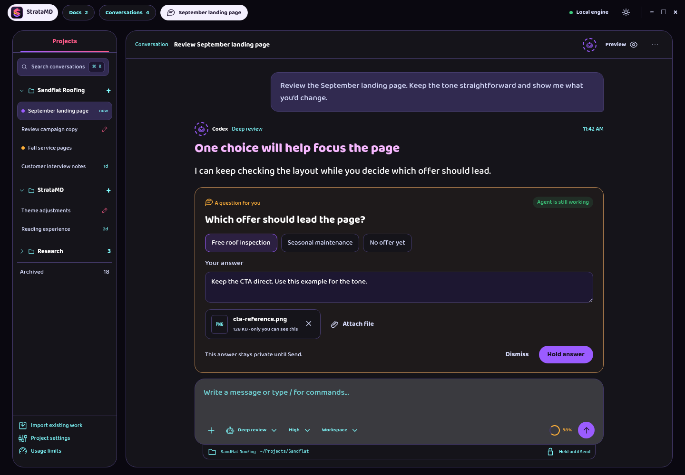

Proposed behavior: Keep Hold answer as the primary card action. Send remains the only way to deliver an answer. Optional questions have Dismiss; questions blocking the agent do not.

Build on: Conversation, held answers, visual markup, and the existing Send composer.

Review states: [Agent still working](http://127.0.0.1:43871/?flow=questions&state=asking) · [Answer held](http://127.0.0.1:43871/?flow=questions&state=held) · [Answer sent](http://127.0.0.1:43871/?flow=questions&state=sent) · [Question dismissed](http://127.0.0.1:43871/?flow=questions&state=dismissed) · [Answer required](http://127.0.0.1:43871/?flow=questions&state=blocking) · [Attachment failed](http://127.0.0.1:43871/?flow=questions&state=upload-error).

## 02. Files you can hand over and read

Attach the actual report or export, inspect it in Strata, and send the file with your message.

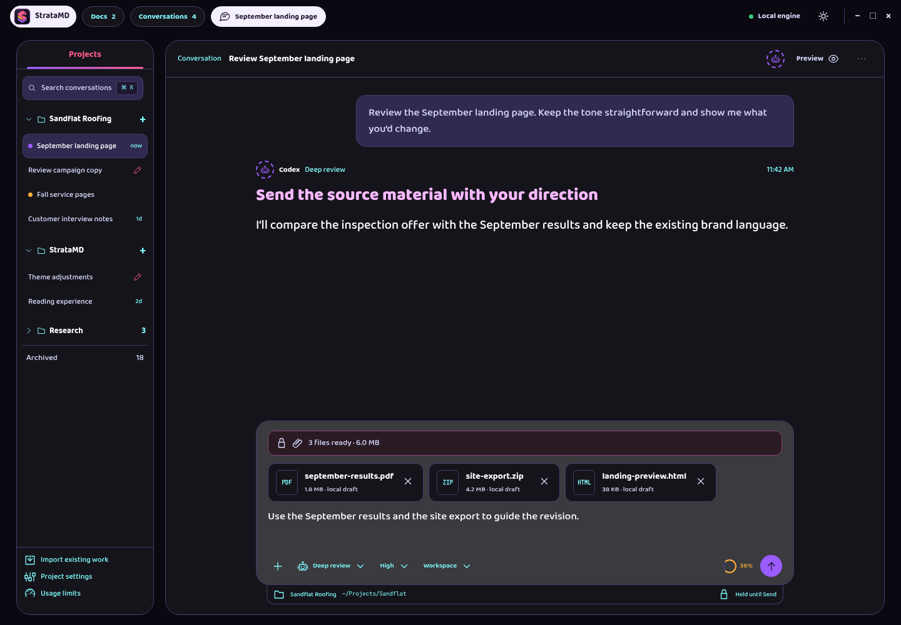

Proposed behavior: A file stays a private local draft until Send. PDFs and HTML open as read-only tabs; editable Markdown keeps its own editor.

Build on: Attachment tray, document tabs, preview frame, and durable draft storage.

Review states: [Ready to send](http://127.0.0.1:43871/?flow=files&state=attached) · [PDF preview](http://127.0.0.1:43871/?flow=files&state=pdf) · [HTML preview](http://127.0.0.1:43871/?flow=files&state=html) · [HTML source](http://127.0.0.1:43871/?flow=files&state=source) · [File unavailable](http://127.0.0.1:43871/?flow=files&state=file-error) · [Send failed](http://127.0.0.1:43871/?flow=files&state=upload-error).

## 03. Know how much room you have

Read quota remaining, when it resets, and whether this window is being used faster than time is passing.

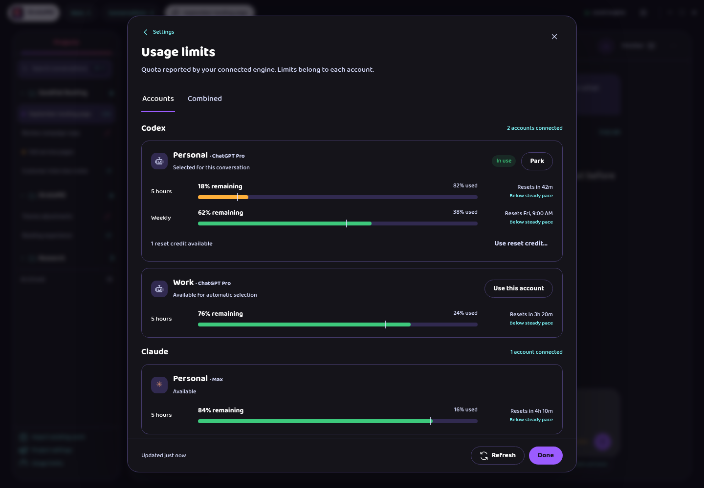

Proposed behavior: Show individual accounts first. The combined view is optional and explains that it averages account percentages.

Build on: Usage Limits dialog, provider groups, account parking, and account choice.

Review states: [Account limits](http://127.0.0.1:43871/?flow=usage&state=accounts) · [Combined limits](http://127.0.0.1:43871/?flow=usage&state=pooled) · [Refresh failed](http://127.0.0.1:43871/?flow=usage&state=stale) · [Not reported](http://127.0.0.1:43871/?flow=usage&state=unavailable) · [Use a reset credit](http://127.0.0.1:43871/?flow=usage&state=reset).

## 04. Make room in a long conversation

An action beside the context meter summarizes model context while leaving your visible conversation available.

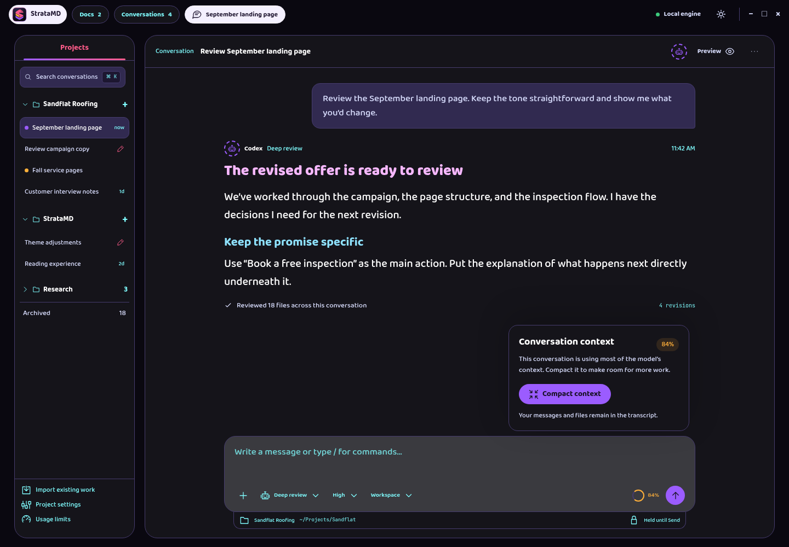

Proposed behavior: Offer the action beside the context meter and through the command menu. Show token counts only when the provider reports them.

Build on: Context-fill indicator, work log, composer options, and provider capability checks.

Review states: [Context is nearly full](http://127.0.0.1:43871/?flow=compact&state=ready) · [Compacting](http://127.0.0.1:43871/?flow=compact&state=working) · [Context compacted](http://127.0.0.1:43871/?flow=compact&state=done) · [Compaction failed](http://127.0.0.1:43871/?flow=compact&state=failed) · [Unavailable for this agent](http://127.0.0.1:43871/?flow=compact&state=unsupported).

## 05. Find the capabilities already installed

Type / to search commands and skills without having to remember their names.

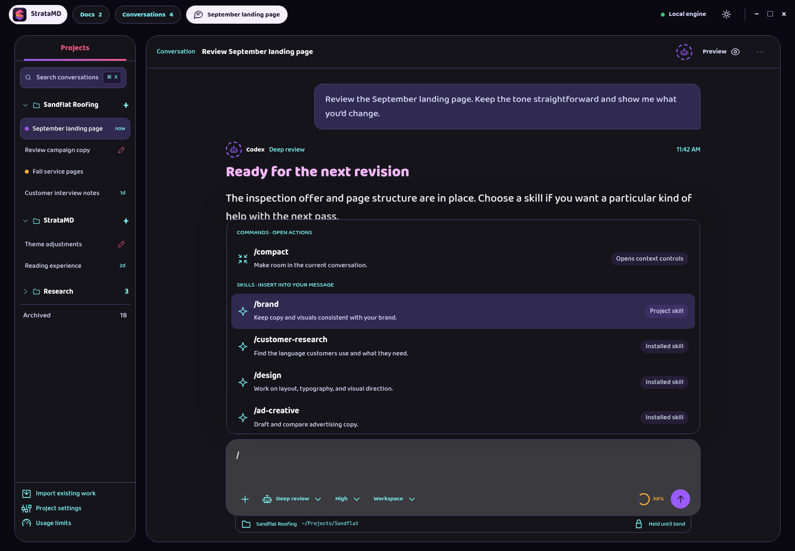

Proposed behavior: Choosing a skill inserts it into the draft. Commands that act immediately are identified separately.

Build on: Conversation composer and provider-reported command and skill lists.

Review states: [Commands and skills](http://127.0.0.1:43871/?flow=skills&state=menu) · [Search results](http://127.0.0.1:43871/?flow=skills&state=filtered) · [Skill in draft](http://127.0.0.1:43871/?flow=skills&state=inserted) · [No matching skill](http://127.0.0.1:43871/?flow=skills&state=empty).

## 06. Find what you have not sent

A small pen in the Projects list identifies conversations with an unsent message.

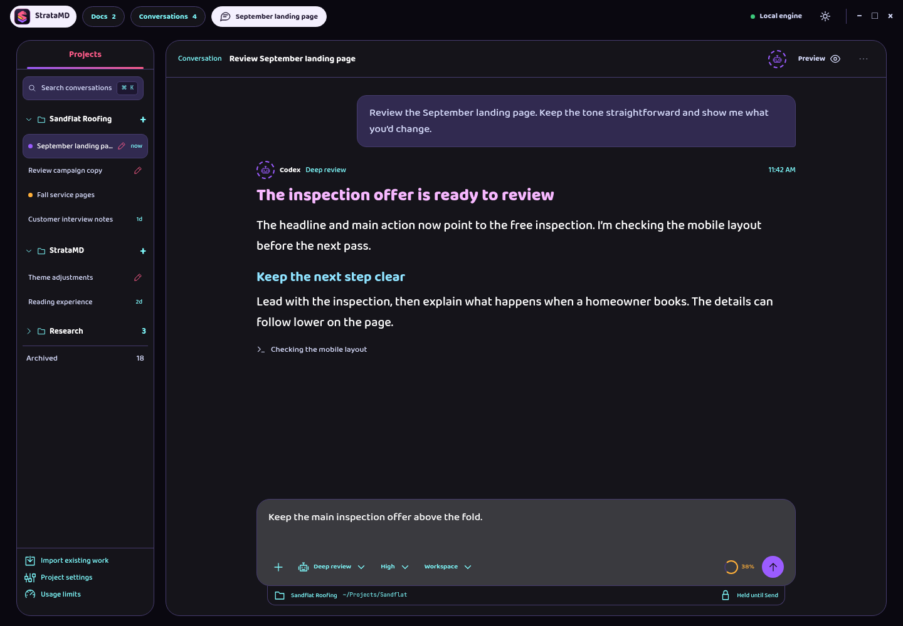

Proposed behavior: Draft markers never replace Working or Needs input. Discard message leaves held comments and answers alone.

Build on: Existing saved composer drafts and thread status indicators.

Review states: [Drafts in the sidebar](http://127.0.0.1:43871/?flow=drafts&state=markers) · [Return to a draft](http://127.0.0.1:43871/?flow=drafts&state=opened) · [Discard message draft](http://127.0.0.1:43871/?flow=drafts&state=discard).

## 07. Set a default, make an exception

Set defaults for new conversations, then change only what a particular project needs.

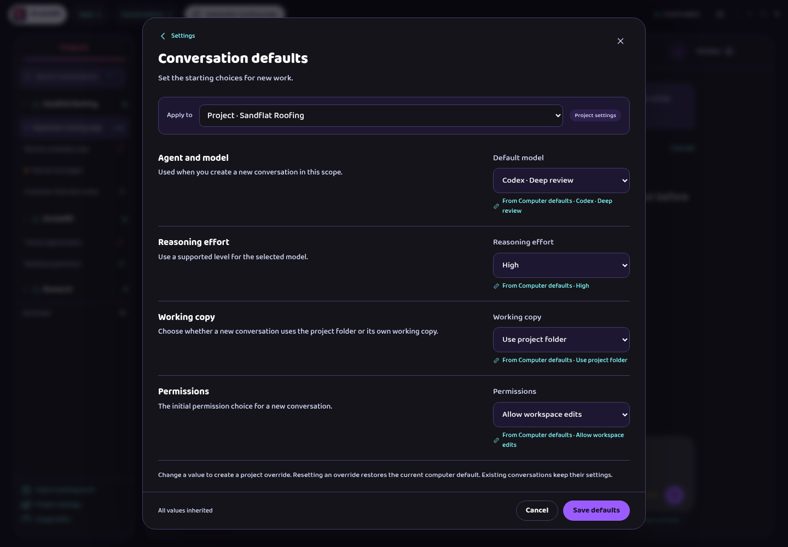

Proposed behavior: Show the effective value and where it comes from together. Existing conversations retain their settings.

Build on: Settings dialog, model options, working-copy choices, and conflict-aware saves.

Review states: [Computer defaults](http://127.0.0.1:43871/?flow=defaults&state=computer) · [Project inheritance](http://127.0.0.1:43871/?flow=defaults&state=project) · [Project override](http://127.0.0.1:43871/?flow=defaults&state=override) · [Settings changed elsewhere](http://127.0.0.1:43871/?flow=defaults&state=conflict).

## 08. Bring existing agent work into Strata

Choose local agent homes, select projects and conversations, then import history without starting an agent.

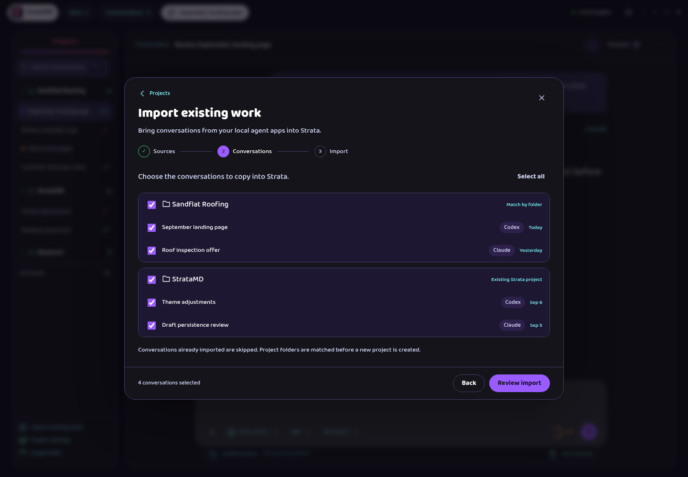

Proposed behavior: Make this an explicit Import existing work flow. Imported history is a copy, with no continuous sync promise.

Build on: Add project entry, setup-dialog layout, provider accounts, and project navigation.

Review states: [Choose sources](http://127.0.0.1:43871/?flow=import&state=sources) · [Choose conversations](http://127.0.0.1:43871/?flow=import&state=select) · [Review import](http://127.0.0.1:43871/?flow=import&state=confirm) · [Importing](http://127.0.0.1:43871/?flow=import&state=progress) · [Some could not be imported](http://127.0.0.1:43871/?flow=import&state=partial) · [Import complete](http://127.0.0.1:43871/?flow=import&state=done).

## 09. Evidence that opens where you need it

An agent can attach a saved screenshot or recording, and you can open the actual evidence in Strata.

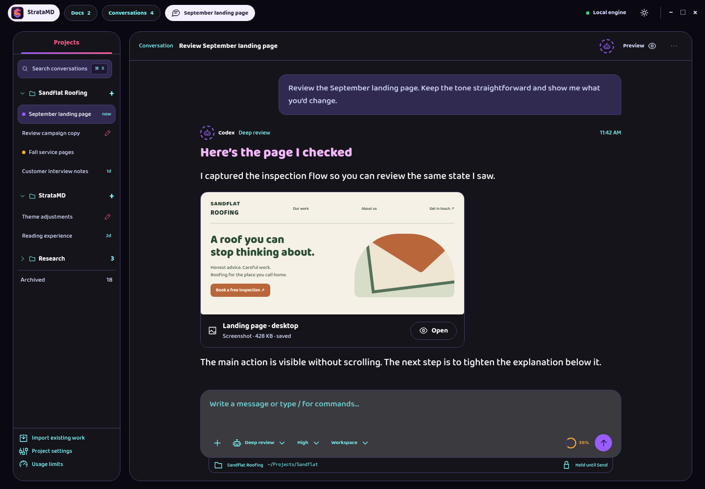

Proposed behavior: Present ordinary media cards. Keep transfer details out of the normal reading flow, but name the destination on a failure.

Build on: Preview tabs, saved visual evidence, annotations, and the transcript.

Review states: [Screenshot available](http://127.0.0.1:43871/?flow=evidence&state=saved) · [Copying recording](http://127.0.0.1:43871/?flow=evidence&state=transfer) · [Copy failed](http://127.0.0.1:43871/?flow=evidence&state=failed) · [Review evidence](http://127.0.0.1:43871/?flow=evidence&state=preview).

## 10. Bring another app into the conversation

Choose a window, capture it, mark what matters, and hold the result for your next message.

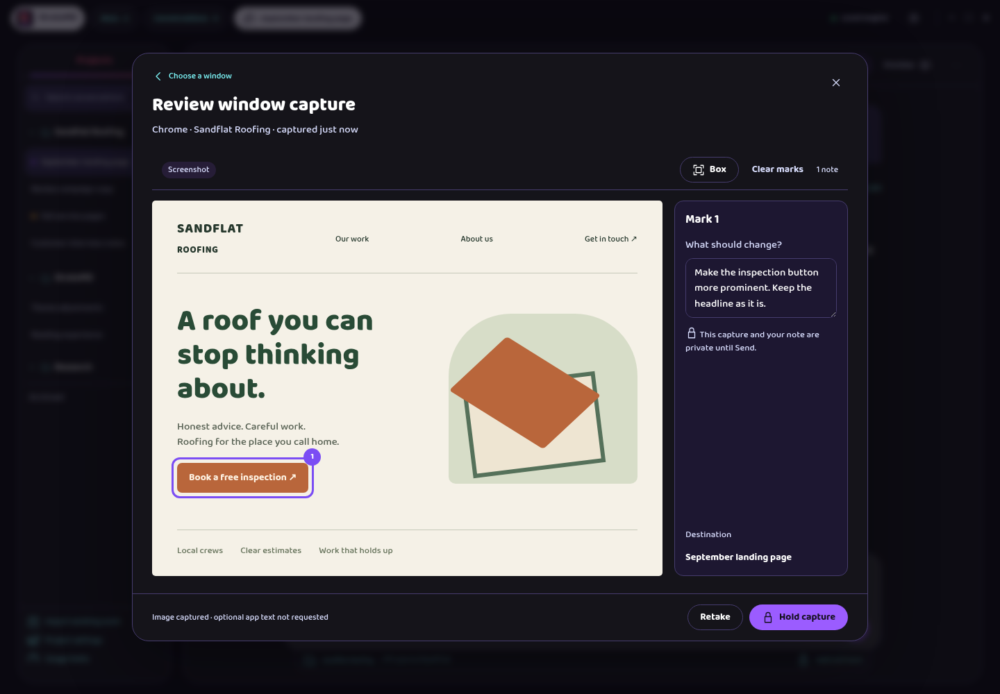

Proposed behavior: Capture is opt-in. Every image lands in review before Send. Native system pickers remain native; the gallery represents their handoff.

Build on: Visual markup, private held comments, image attachments, and Send.

Review states: [Capture settings](http://127.0.0.1:43871/?flow=capture&state=setup) · [Mac permissions](http://127.0.0.1:43871/?flow=capture&state=mac-permission) · [Choose a window](http://127.0.0.1:43871/?flow=capture&state=choose) · [Mark and hold](http://127.0.0.1:43871/?flow=capture&state=review) · [No app text available](http://127.0.0.1:43871/?flow=capture&state=screenshot-only) · [Capture held](http://127.0.0.1:43871/?flow=capture&state=held).

## 11. Return to your work after a restart

A preference controls continuation. Reconnecting preserves the conversation in place and explains the result.

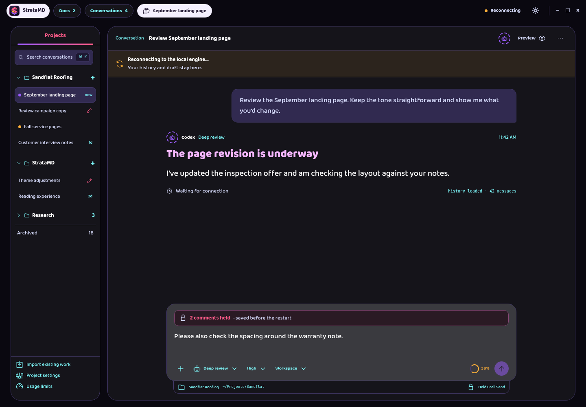

Proposed behavior: Continuation starts off. Never claim active work resumed until the engine confirms it. Performance work adds no settings of its own.

Build on: Engine settings, status button, thread list, managed-engine backups, and conversation history.

Review states: [Continuation preference](http://127.0.0.1:43871/?flow=recovery&state=setting) · [Reconnecting](http://127.0.0.1:43871/?flow=recovery&state=reconnecting) · [Session resumed](http://127.0.0.1:43871/?flow=recovery&state=resumed) · [Continuation message sent](http://127.0.0.1:43871/?flow=recovery&state=continued) · [Could not resume](http://127.0.0.1:43871/?flow=recovery&state=failed).

## 12. Name a model and tune its supported options

Keep the provider model ID intact while choosing a readable name and editing supported options.

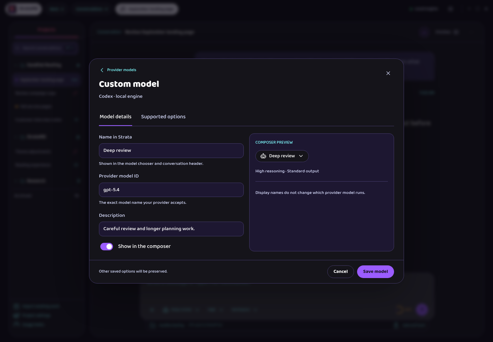

Proposed behavior: Offer only options that the provider can use. Existing options from another client remain preserved even when Strata cannot edit them.

Build on: Provider Models tab, favorites, visibility, model order, and composer option controls.

Review states: [Provider models](http://127.0.0.1:43871/?flow=models&state=list) · [Model details](http://127.0.0.1:43871/?flow=models&state=edit) · [Supported options](http://127.0.0.1:43871/?flow=models&state=options) · [Invalid option value](http://127.0.0.1:43871/?flow=models&state=invalid).

## Verification and saved artifacts

The gallery was checked in Chromium with agent-browser. All 58 states were captured at 1440 × 1000. Each state also passed layout checks at 1280 × 800 in Night and 960 × 800 in Light. Fourteen interaction checks covered answer delivery, dismissal, file previews, skill search, compaction, draft discard, import selection, inheritance reset, capture opt-in, held captures, model validation, reconnect preservation, keyboard selection, and review-note persistence. Browser errors were empty.

[Verification record](verification.json) · [Local gallery file](index.html)

The checks cover the standalone mockup. They do not establish product behavior, native permissions, real file rendering, provider compatibility, or performance. Those are implementation work after design approval.
