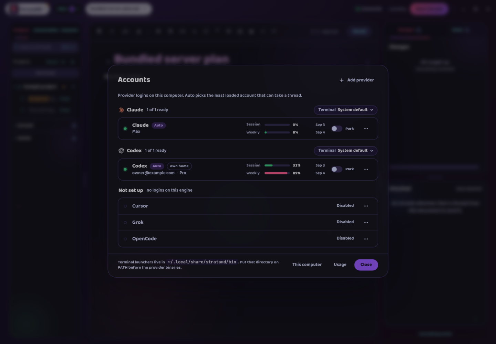
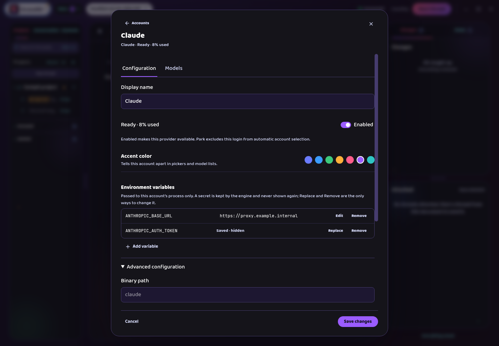
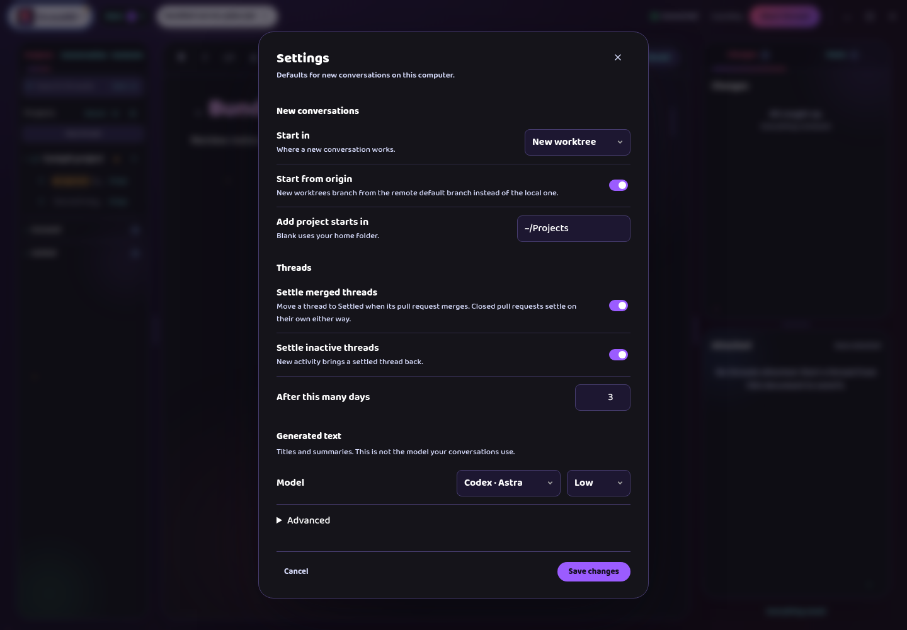
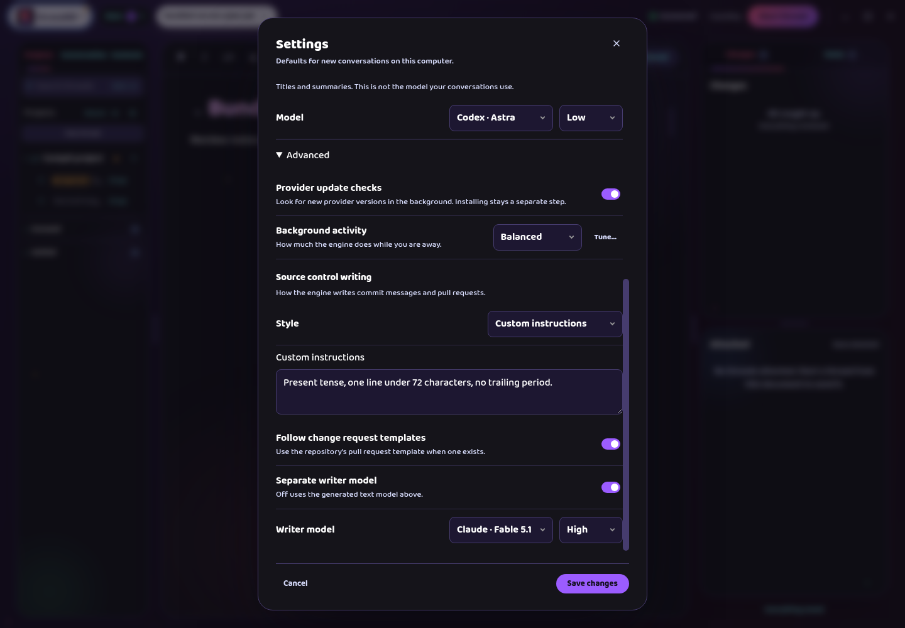
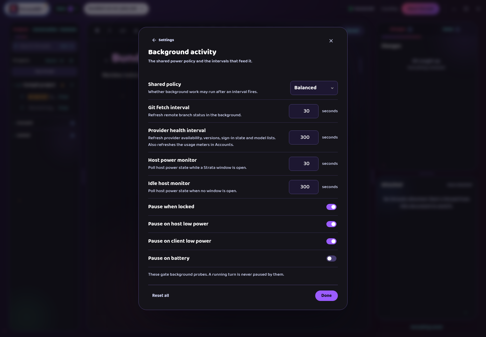
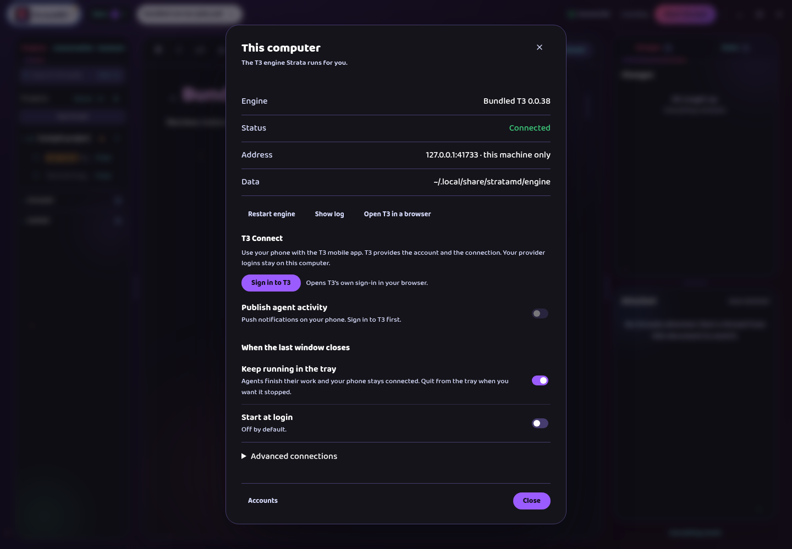
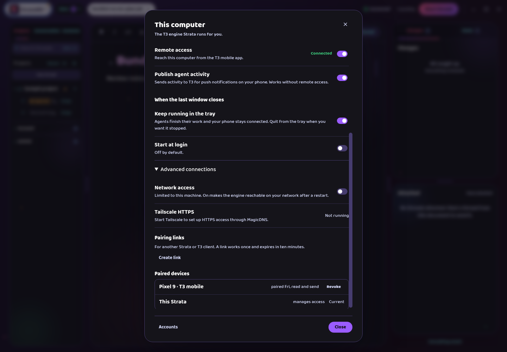
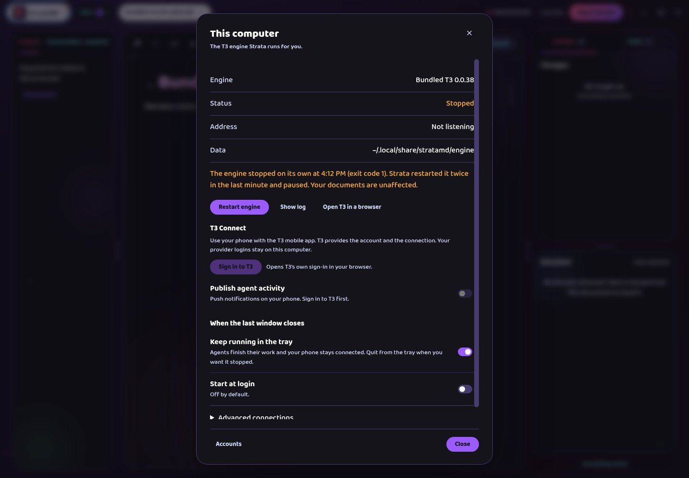
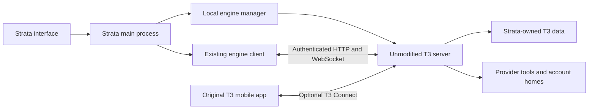

# Bundle the T3 server in Strata

Status: phase 1 Linux proofs and repository gate passed; owner/device proofs recorded as blocked. Phase 2 is next. Last revised September 5, 2026; the [changelog](#changelog) at the end records what changed and why.

This file is the source of truth for the implementing agent. Rules are stated once, in the present tense. The [settings audit](settings-audit.md) is the scope checklist for every engine control, the [inspection record](references/README.md) holds the evidence captures, and the [design captures](../../../design/bundled-server/README.md) show the proposed dialogs inside the real app.

## Decisions

- Strata ships the official published `t3` server package, unmodified, with its own Node runtime and its own data directory. The owner's fork of T3 is not bundled and is not changed by this work.
- Strata starts the engine, connects to it without a pairing step, keeps it healthy, and updates it with the application. External pairing to another T3 server remains available.
- Closing the last window keeps Strata running in the tray with the engine alive. Quit is explicit. Start at login is a separate switch, off by default.
- Usage measurement moves into Strata. Claude is read through the Claude Agent SDK's usage query, Codex through a direct app-server query when idle. Both are proven in phase 1. Only verified local accounts are probed.
- Generated text keeps T3's behavior: a manual model and effort choice with T3's default and no Automatic option.
- T3's agent browser setting stays on. Strata's own browser registers with the server as the automation host under its own plan.
- Migration of an existing T3 installation is deferred past the first release. Its design is kept below for when it is built.
- There is no installer or updater in this plan. Strata ships unpacked folders as today, and the engine runs from a versioned copy under application data so a folder replacement can be rolled back.
- Every account control stays in the existing Accounts dialog. Engine controls live in a Settings dialog from the logo menu and in This computer, which replaces the Engine dialog. There is no settings navigation column.
- Phase 1 proved the Linux package, bootstrap, existing provider discovery, both usage readers, and a stock-server conversation. Hosted authorization, Android and macOS remain release blockers. Continue implementation under the owner's explicit exception for unavailable sign-ins/devices.
- T3 0.0.38 rejects port zero. Allocate a free loopback port, then verify the pid and address in its runtime record; retry a bind race.
- T3 Connect login and link are interactive in 0.0.38; only status supports JSON. Host upstream interaction and use JSON status plus live authenticated relay state as the authority.
- Codex usage windows are classified by duration. Claude's SDK usage method is experimental and absence means unavailable usage. Refresh provisional provider status before offering installation.
- linux-arm64 is outside the first release: the published package ships no helper binary for it.

## What the user gets

| Situation | Behavior |
| --- | --- |
| Fresh install with existing provider sign-ins | The usual Strata workspace opens. Accounts are detected and the bundled engine is connected automatically. |
| Fresh computer without a usable provider | Accounts shows Sign in or Install in the account row. Sign in opens the provider's own sign-in; Install prepares the tool in Strata's own folder through the provider's official installer. Documents keep working. |
| Daily launch | The workspace opens immediately. A brief starting state shows only if the engine is not ready yet. |
| Use the phone | This computer → T3 Connect, Sign in to T3, turn on Remote access, then pick the Strata environment in the T3 mobile app. |
| Already paired to an external T3 server | The connection keeps working. A reviewed switch to the local engine is offered once phase 2's engine-identity work is complete. |
| T3 Code open at the same time | Separate servers, separate data. Neither app writes to the other's database. |
| Close the last Strata window | Strata stays in the tray; agents finish and the phone stays connected. Explained once, the first time. |
| Quit Strata | The engine stops. Active work is shown before quitting. |
| Sleep or lost connectivity | The environment shows as unavailable remotely and reconnects after wake. No always-on promise. |

## Evidence

The installed T3 Code 0.0.37 desktop app was operated in a disposable profile and every settings screen was captured; the [settings audit](settings-audit.md) maps each control from those captures. An isolated Strata build was paired to that disposable server and detected the existing Codex and Claude sign-ins. [Actual T3 providers](references/t3-providers.png), [actual Strata accounts](references/strata-accounts.png).

That installed 0.0.37 app is the owner's fork build, not the official release. Its server adds live subscription usage on each provider, terminal shim status, and parked-account settings that the official package does not have. The audit therefore proves account discovery against the fork, and the [usage section](#usage-measurement) keeps the meters without it.

The official npm package `t3` 0.0.38 was downloaded and inspected. It is about 100 MB, of which 71 MB is the bundled web client, so the server's browser UI ships with it. It uses Node's built-in SQLite and requires Node 22.16 or newer. Its native modules are node-pty, fff-node and msgpackr-extract, installed as ordinary dependencies rather than shipped in the tarball. The public T3 Connect identifiers and relay address are baked in, so its connect commands are enabled. It ships resource-monitor helper binaries for linux-x64, darwin-x64, darwin-arm64 and win32-x64. [Upstream package](https://github.com/pingdotgg/t3code/blob/main/apps/server/package.json).

Not tested: a signed-in T3 Connect tunnel, mobile discovery of a Strata-owned environment, an Android turn, a clean machine with no provider tools, macOS, and either usage reader from Strata's own process. Phase 1 proves these.

## Proposed screens

Captures of the real app: the built main process, the e2e suite's fake T3 engine, the shipped Strata Vivid theme, and each proposed dialog injected with the renderer's own classes. Sample data throughout. [How they are made and what each covers](../../../design/bundled-server/README.md).

### Accounts

Every account control stays in the Accounts dialog Strata already has, the way the parity mockup of September 5 settled it. The dialog is unchanged apart from the footer, where Engine becomes This computer. On a machine with nothing signed in, the same dialog carries Sign in or Install in the account row and a line saying documents keep working.



Manage, from the account's menu, is the existing view with the audit's added fields: accent color, environment variables with distinct edit, replace, and remove states for secrets, and Auto-compact after under Advanced for Claude. OpenCode shows its server URL and password in the same place; T3 stores that password in plain text and the field says so ([actual OpenCode settings](references/t3-provider-opencode.png)). The Models tab keeps the star and Hide and adds order controls and a custom model id.



Save changes applies only the fields the user edited. A failed save keeps the form. A hidden saved secret never becomes an empty replacement by accident.

### Settings

One dialog from the logo menu. New conversations, the settle switches, and the generated text model with T3's default. Start from origin appears because New worktree is chosen, as in T3. Compare [T3 General](references/t3-general-top.png) and [the conditional workspace settings](references/t3-general-workspaces.png).



Generated text: T3's default is Codex, and its fallback only checks that the configured provider is enabled, not that it is installed and signed in. Codex starts enabled, so a Claude-only machine gets no titles until the model is changed here. Strata does not change the selection on its own. Accounts shows one line pointing at Settings when the generated-text account is not ready.

Advanced holds provider update checks, the background profile, and source control writing. Custom instructions and the writer model row show because their switches are on.



Tune… beside the profile opens T3's background dialog with its eight controls ([actual T3 dialog](references/t3-background-advanced.png)).



### This computer

Replaces the Engine dialog for the managed engine: engine facts and recovery actions, T3 Connect, what happens when the last window closes, and Advanced connections. The section is named **T3 Connect** and the action is **Sign in to T3**. It opens T3's own sign-in in the browser; Strata shows the result. This is where that entry lives in T3 today: [Connections](references/t3-connections.png), [sign-in](references/t3-connect-signin.png).



After sign-in the environment is named "Strata on [computer name]" so it is distinguishable from a separate T3 Code installation. Remote access and activity publishing are separate switches; T3's own copy says publishing works without the tunnel. Advanced connections holds network access, Tailscale, pairing links, and paired devices with revocation, under the upstream rules. This state is the intended result, not a tested one.



A stopped engine names the failure and offers Restart while the shell behind it shows Disconnected. Documents stay available.



An expired login says "Sign in to T3 again", never "Sign in to Strata". T3 Connect failures leave local work available. Mobile uses the original T3 app; bundling the server does not put Strata's editor in it.

## What gets bundled

The official `t3` package, its production dependency tree, and a dedicated Node runtime that satisfies the package's engine range. Include the package's web client, native modules, and helper binaries; the JavaScript entry point alone does not run. [Upstream package manifest](https://github.com/pingdotgg/t3code/blob/main/apps/server/package.json).

A dedicated Node keeps the server's native modules independent of Strata's Electron upgrade cycle. Reusing Electron's Node mode is a later size optimization, not a first-release choice. Verify the packaged app on each shipped platform and architecture: Linux x64, macOS x64 and arm64.

Include third-party notices and license files. T3 is MIT; dependency notices go in the packaging inventory. The license does not grant access to T3's hosted identity or relay service. [T3 license](https://github.com/pingdotgg/t3code/blob/main/LICENSE).

The relay client for T3 Connect is cloudflared. The CLI downloads it from GitHub releases at a pinned version after a confirmation prompt, or uses a path from an environment variable. Stage a supported artifact or let the CLI acquire it with visible progress. If acquisition fails, local Strata keeps working.

Provider executables are separate. Prefer an existing valid tool; prepare a missing Codex or Claude in a Strata-managed folder through the provider's official distribution mechanism. Never replace the user's global installation. Other providers keep their documented prerequisites with actionable status in Accounts.

## Architecture



The engine manager owns process startup, health, shutdown, and staged updates. The existing engine client keeps conversation traffic, dispatch receipts, retry handling, and reconnect cursors. The two stay separate so an engine crash never creates a second send queue.

### Storage layout

Everything lives under Strata's data directory, the one that already holds the engine files, with owner-only permissions:

```
<data>/stratamd/
  engine-credential.json, engine-conversations.json, …   existing engine files, keyed by engine from phase 2
  engine/
    lock                    held for the life of the managed engine process
    runtime.json            runtime record: engine directory, runtime version, executable, pid, launch generation, resolved address
    t3/                     the server's base directory, passed as --base-dir; the server owns everything inside
    runtime/<version>/      the staged copy of the bundled server and Node for that version
    backups/<iso-time>-<version>/   database and attachment manifest taken before an engine version change
    log/                    engine stdout and stderr, rotated
```

The engine runs from `runtime/<version>/`, never from the application folder. On first launch, and whenever the bundled version differs from the version in the runtime record, Strata stages the bundled runtime into a new versioned directory and verifies its native modules before starting it. The previous copy stays until the new version has completed a clean session.

The connection mode is a Strata setting in the existing settings file: `engine.mode`, either `managed` or `external`. A fresh install is `managed`. An install with an existing engine credential stays `external` until the user switches.

### Startup

1. Open the shell and the document store immediately. Read `engine.mode`.
2. For `managed`, take `engine/lock` before any process work.
3. Read `runtime.json`. Reuse a surviving process only after its pid, executable, data directory, and authenticated health all match the record. A process that merely answers on a familiar port is not adopted.
4. Stage the runtime if the bundled version differs from the record, then start the server with `--base-dir <data>/stratamd/engine/t3`, `--host 127.0.0.1`, an allocated nonzero free port, and `--no-browser`. Use the address the server reports, never an assumed port.
5. Pass a bootstrap token through `--bootstrap-fd`. The envelope is the desktop app's shape: mode `desktop`, host, port, the base directory, the token, and no telemetry descriptors. The server seeds that token as an administrative grant that stays valid for reuse until its lifetime ends. Strata exchanges it through the same token-exchange call its pairing already makes, so the existing pairing code works unmodified. The seed lives in main-process memory only; it is never written to disk, passed on the command line, or sent to the renderer. If phase 1 finds that desktop mode has side effects Strata does not want, the CLI's auth token command issues an administrative session from the base directory instead. Neither route patches the server.
6. Persist the session credential as today and renew it with the existing client logic.
7. Read settings and account readiness, resume subscriptions, and replay only pending operations the server has not acknowledged.

### Process rules

Bounded restart attempts with backoff. An unrecoverable startup failure opens This computer with the failure named. Quit stops the process gracefully, waits for active work or asks about interrupting it, then terminates only the verified process tree. A stale pid alone is never permission to stop a process. Never kill T3 or provider processes by name.

With the last window closed, the main process and the engine keep running, a tray or menu-bar item reopens Strata, and Quit is explicit there. Strata never installs T3's own background service; its onboarding offers one and that would create a competing owner. [Upstream background-service documentation](https://github.com/pingdotgg/t3code/blob/main/docs/user/background-service.md).

### Engine identity

Strata's records name conversations and projects by id alone, and two engines can hold the same id. Today that is true of the five engine files in the data directory, of each open document's session, which holds thread attachments with queued deliveries, processed message ids, and the Lead choice, of the renderer's local storage, which holds composer drafts by conversation, per-project conversation defaults, and the new-conversation selection, and of in-memory dispatch keys and reading state. Reconnect reposts every pending command to whichever engine is connected.

Phase 2 starts with a written inventory of every such record, in main-process files, document metadata, renderer storage, and memory, and gives each one an engine identity or a rule for clearing it on switch. The switch from external to managed is offered only after that inventory is complete and tested.

### T3 Connect

Use the upstream CLI's separate `connect login`, `link`, `status`, `publish`, `unlink`, and `logout` subcommands against Strata's base directory. Never the top-level `connect` onboarding, which offers a background service. Expose progress and status through main-process IPC. Host upstream interactive commands without treating their terminal text as structured state; query `connect status --json` and the authenticated server's live relay state after each action. Support the browser authorization lifecycle including cancellation and callback failure.

T3 identity tokens and environment-link credentials stay in the upstream credential store for this environment. Use the package's baked-in public client configuration; never invent OAuth credentials or impersonate another application. After linking, apply the change the way upstream requires, including a controlled restart if needed, and check relay readiness before showing Connected. Publishing has its own visible opt-in. Sign-out disables remote access and publishing and says whether the T3 account stays signed in on its website.

Direct pairing stays for external servers and Advanced connections: reachable endpoints, link lifetimes, requested permissions, paired-session management, and revocation under the upstream rules. A network-listener change is always explicit, never a side effect of local startup.

## Settings implementation

The [settings audit](settings-audit.md) is the scope checklist; its final section lists the upstream key for each control. Add a shared model for supported engine settings and a separate model for Strata's own preferences: `engine.mode`, tray behavior, and start at login.

Read settings from the connected engine. Apply small validated patches. Preserve unknown upstream fields and secret references. Treat an absent capability as unsupported, never as a false value to write back. Where the upstream call replaces a whole collection, refetch and merge before saving, and handle a concurrent change from another client explicitly.

Reuse `AccountsDialog`, `ProviderSetup`, `WorkspaceControls`, and the model-selection UI. Add the Settings dialog from the logo menu and turn `EngineDialog` into This computer with T3 Connect inside it. The logo menu's Accounts item keeps opening the Accounts dialog.

Strata's own store stays the authority for parking, Auto, favorites, hidden models, terminal defaults, and unsent drafts. The stock server has no matching fields, so nothing is written back to it.

Fresh engines use upstream defaults. The agent browser setting stays on: the server injects the preview tools and routes each call to whichever client has registered as the automation host, and Strata's browser registers the same way under its own plan. Until it lands, a preview call fails the way T3 fails with no desktop attached.

Background policy needs runtime signals as well as the form. Forward window focus and visibility and the supported host power signals so the idle and low-power settings mean something.

## Usage measurement

The Session and Weekly meters, reset times, plan labels, and the load data behind Auto's least-loaded choice came from a fork-only field. The official package never sends it. Strata's main process takes the readings itself, in phase 3, after phase 1 has proven both readers.

- Claude: the Claude Agent SDK's usage query, run against the account's configured home. It uses the account's own sign-in however it is stored, including the macOS Keychain, so no token file is read. Credential renewal follows the SDK. An unavailable reading is unknown, never zero.
- Codex: a direct query to the Codex app-server for the account's rate-limit windows and plan label, on the provider health cadence, while the account is idle. The stock server creates a rate-limit event during a turn and drops it, so turn events are not a source. During a running Codex turn the meter keeps its last reading, labeled with its time, unless phase 1 proves a safe way to read limits while the account is busy.

Only accounts Strata can verify as local are probed: the engine is the managed one, or the account's home is on this computer. An external server on another machine shows usage as unavailable. Strata never launches a provider process or reads a credential for an account it cannot prove is local.

Readings, parking, favorites, and terminal selections are keyed by provider instance id, and two servers can use the same id for different accounts. On a switch the old connection keeps its store and the new engine starts fresh. Strata offers to carry a preference forward only when the account matches on driver plus signed-in identity, such as the email the provider reports. Anything unmatched stays with the old connection.

The measurer never interrupts a provider's execution of an active turn and records the measured time so a stale reading is labeled. Terminal defaults, parking, and Auto stay in Strata's own store. The server's terminal shim status and parked settings, where a fork has them, are ignored.

## Updates and rollback

Each Strata release carries a known server artifact. Nothing at runtime rejects another T3 version; the connection path has no version lock and this plan adds none. Track the installed version in diagnostics and release records, and verify the operations Strata uses. An external server may be newer or older as long as those operations remain compatible.

Without an installer, an update is the user replacing the application folder, so the previous engine cannot live there; it lives in `engine/runtime/<version>/`. The first launch after a replacement:

1. Compare the bundled engine version with the runtime record.
2. If they differ, stage the new runtime into its own versioned directory and verify its native modules.
3. Wait for any active turn to finish, or ask.
4. Take a dated backup of the database and attachment manifest under `engine/backups/`, recording which engine version wrote it.
5. Stop the old engine, start the new copy, verify authenticated readiness and subscriptions, and reconnect.
6. Keep the previous runtime copy and the backup until the new version completes a clean session.

Restore starts the previous copy against its matching backup, after showing the backup time and any newer work at risk. Newer conversations are never discarded silently. Never restart during an agent turn without the user's explicit choice. A newer server with an unknown optional setting keeps working; an incompatible required operation names the affected feature and offers the update.

## Migration

Deferred past the first release. Phase 5 starts only after phases 1 and 2 prove the stock server. The design stands for when it is built.

Migration is optional for existing users and unnecessary for new installs. An external server on another machine stays external unless a separately designed export path exists. For a local source, first show the source path, projects, conversations, attachments, active work, data size, and Strata document links; check space and the source schema before offering the copy. Wait for active work to finish and take a consistent snapshot through a supported backup facility or a coordinated SQLite backup with its file assets; a plain copy of a live database is not enough.

Copy into a staging directory. Preserve project and thread ids, timestamps, provider session references, and attachments. Inventory worktree and checkpoint locations, including anything outside the database. Keep valid absolute project locations; repair worktree references only through the supported Git path. The new environment gets its own identity and local authorization and links T3 Connect again; it never reuses a live T3 Connect environment identity while the original is online.

Verify that document associations open the same conversations, attachments resolve, drafts survive, and queued sends cannot cross environments. Only then switch the selected connection and mark the migration complete, keeping the previous connection and backup for recovery. Writes after the switch belong to the new environment; diverged histories are never merged automatically. The original T3 installation stays usable with its original data; nothing points a second server process at Strata's data directory.

## Phases

| Phase | Work | Completion evidence |
| --- | --- | --- |
| 1. Prove the integration | The task list below. | The packaged Strata build runs a conversation with T3 desktop closed. The Android app finds the separate Strata environment, completes a turn, and reconnects after a server restart. Both usage readers return the provider's own numbers on Linux and macOS, or the report records which reading is unavailable. The phase 1 report is written. |
| 2. Own the local engine | Engine manager: lock, runtime record, staging, bootstrap, restart policy, shutdown, tray, automatic connection. The engine-identity inventory and keyed stores. Managed-engine test mode. PRD and conformance changes. External mode preserved. | No manual local pairing. Repeated launches create one owned server. Owner T3 and Strata coexist with separate stores. Failures preserve pending sends. Nothing queued for one engine posts to another. Full Playwright run and the eight-worker repeat pass, as AGENTS.md requires for a launch-path change. |
| 3. Settings and accounts | Engine settings contracts and safe patching, Settings dialog, Accounts additions, model controls, provider readiness and setup, background signals, usage measurement. | Every Include row in the audit is exercised through the UI; persistence survives app and server restarts. Unsupported capabilities are handled without erasing data. Meters and Auto work against the stock server. |
| 4. T3 Connect and background UX | Sign in to T3, status, publishing, remote access, Advanced connections, tray behavior, start at login. | Cancelled and expired login, missing relay client, offline network, sign-out, revocation, window close, quit, and wake all have verified outcomes. |
| 5. Migration, deferred | Source inspection, snapshot, staged copy, identity separation, verification, switch, recovery. | A populated disposable T3 environment migrates with attachments and Strata links intact. Interrupted copies keep the old connection usable. |
| 6. Distribution and release | Dependency inventory and notices, unpacked folders, folder-replacement upgrade and rollback tests, PRD documentation, repository gates. | Fresh-machine Linux and macOS package checks, upgrade from external pairing, Android connection, and all required automated checks pass. |

Broad settings work does not start before the phase 1 remote result is known. If the stock package cannot authorize a Strata-owned environment with T3's hosted service, that changes the product decision; record the exact missing capability and revisit, never turn this into a server fork.

### Phase 1 task list

Work in a throwaway packaging spike, not on master's product code, and keep every artifact under `docs/plans/open/bundled-t3-server-2026-09-05/phase-1/`. Nothing here touches the owner's running T3, its data, or the checked-in app.

1. **Package.** Build the Linux unpacked folder with `t3@0.0.38`, its production dependencies, and a Node runtime staged the way the storage layout describes. Record the exact versions and the folder size. Confirm node-pty, fff-node, and msgpackr-extract load from the staged copy.
2. **Start and bootstrap.** Start the server with the flags in the startup sequence and a bootstrap envelope through `--bootstrap-fd`. Exchange the token with Strata's existing pairing call. Record what desktop mode changed: startup presentation, any expectation of telemetry descriptors or a helper path, anything else observable. If anything is unwanted, repeat with the auth token command and record which route the plan keeps.
3. **Separate data.** With the owner's T3 running, confirm the spike's base directory, port, and environment identity are its own and that neither process touches the other's database.
4. **Accounts.** Confirm the stock server discovers the existing Codex and Claude sign-ins. Then, on a machine or container with no provider tools, run each provider's official install into a Strata-managed folder and complete its sign-in. Record the commands and what the user sees.
5. **Usage readers.** From a plain Node process, not the server: run the Claude Agent SDK usage query against the Claude home on Linux and on a Mac with Keychain credentials; run a Codex app-server rate-limit query while idle; attempt one during a running Codex turn. Record the numbers beside what the provider's own UI shows, and record any reading that is unavailable.
6. **T3 Connect.** With the spike's base directory, run `connect login`, `link`, `status`, and `publish`. Confirm the relay client download prompt and result. Sign in on the Android app, find the environment, complete a turn, restart the server, and reconnect. Then `unlink` and `logout` and confirm the environment disappears. Record each step with a capture.
7. **macOS.** Repeat steps 1, 2, and 5 on macOS x64 or arm64, whichever is available, and record which.
8. **Report.** Write `phase-1/report.md`: versions, commands, captures, each proof's result, and every finding that changes this plan. Update this plan's decisions and changelog from the report before phase 2 begins.

## Code locations

| Area | Existing location and planned responsibility |
| --- | --- |
| App lifecycle | [src/main/index.ts](../../../../src/main/index.ts): start the engine manager, last-window and quit behavior, tray, start at login, second instance. |
| Engine manager | New small modules beside [src/main/engine/client.ts](../../../../src/main/engine/client.ts): lock, runtime record, staging, bootstrap, lifecycle, backups. Conversation dispatch stays in the client. |
| Engine identity | The client's stores, [application.ts](../../../../src/main/application.ts) document sessions, and the renderer's local storage: the phase 2 inventory and keying. |
| Protocol and settings | [t3-contract.ts](../../../../src/main/engine/t3-contract.ts) and [shared contracts](../../../../src/shared/contracts.ts): settings reads and writes, capability handling, relay status, typed errors. |
| IPC | [preload/index.ts](../../../../src/preload/index.ts) and [channels](../../../../src/preload/channels.ts): narrowly scoped settings and lifecycle actions. No arbitrary renderer shell execution. |
| Accounts and usage | [accounts.ts](../../../../src/main/engine/accounts.ts), [provider-instance.ts](../../../../src/core/provider-instance.ts): added provider fields and secret actions. New small module beside accounts.ts: the Claude and Codex usage readers feeding the existing measurements store. |
| Strata preferences | [src/main/settings.ts](../../../../src/main/settings.ts): `engine.mode`, tray behavior, start at login. |
| UI | [EngineDialog](../../../../src/renderer/components/EngineDialog.tsx) becomes This computer; [AccountsDialog](../../../../src/renderer/components/AccountsDialog.tsx) and [ProviderSetup](../../../../src/renderer/components/ProviderSetup.tsx) gain the added fields; a new Settings dialog reuses [WorkspaceControls](../../../../src/renderer/components/WorkspaceControls.tsx) and the model picker. |
| Tests | [harness.ts](../../../../test/e2e/harness.ts): external mode by default; `STRATAMD_ENGINE_MODE=managed` opts a spec into the real bundled runtime, and those specs run serially. Engine dialog, cockpit pairing, and shell visual baselines change with the new start state. |
| Packaging | [package.json](../../../../package.json), [build-packaged.mjs](../../../../scripts/build-packaged.mjs): stage the runtime and dependencies, helper binaries, notices, integrity manifest. |
| Specification | [PRD](../../../../docs/PRD.md) §2 goal 7, §3, §6.9 last-window rule and Engine dialog text, and the [conformance map](../../../../docs/PRD_CONFORMANCE.md), changed in phase 2 together with the code their tests enforce. |

## Verification

| Test | Required result |
| --- | --- |
| Fresh machine, no T3 or system Node | Strata supplies its engine runtime and never invokes a global npx installation. |
| Existing Codex and Claude login | Valid tools and account homes are detected without re-entering credentials. |
| Missing provider, expired login, Claude only | Clear setup or repair; a first conversation succeeds. With no Codex account, Accounts shows the generated-text line pointing at Settings, and choosing a Claude model there produces a title on the next conversation. |
| Secret setting edit | Unchanged masked values stay unchanged; replace and remove are explicit; logs and snapshots omit secrets. |
| Source-control credentials absent | Ordinary conversations work. Only affected Git service actions ask for their own setup. |
| Simultaneous Strata launches, occupied ports | One server for Strata's store. A free address is resolved without adopting another application's server. |
| Engine crash, Strata crash, orphaned child | Verified owned processes recover without duplicate turns or data corruption. |
| T3 desktop open at the same time | Separate databases and environment identities; no cross-process ownership guesses. |
| Settings changed from another client | Visible state refreshes without overwriting untouched or unknown values. |
| Usage meters on the stock server | Session, Weekly, reset time, and plan label match the provider's own reporting for Claude and Codex, on Linux and on macOS with Keychain credentials. Only verified local accounts are probed; an external server shows usage as unavailable. A stale reading carries its time; an unavailable reading is never shown as zero. |
| Engine switch with queued sends | Nothing queued for the previous engine posts to the new one: main-process files, document attachments and their deliveries, renderer drafts and defaults, and in-memory dispatch all resolve to one engine. Preferences carry forward only for accounts matched by driver and signed-in identity. |
| Background policy | Visible, backgrounded, locked, battery, and low-power states produce the expected probe behavior. Active turns stay governed by provider execution. |
| Mobile | The Android app, same T3 account, separate named environment; reconnect after app and server restarts; publishing off is respected. |
| Close, quit, login, sleep | Behavior matches the settings and their copy. No invisible always-on promise. |
| Update and rollback | Idle transition, matching backups, clear recovery, no silently discarded post-update work. |
| Accessibility | Keyboard navigation, dialog focus, Escape and return, screen-reader labels, visible error states, scrolling at the minimum window size. |
| Migration, deferred | Preserve ids, attachments, provider and worktree references, documents, drafts, and dispatch receipts. Failure before verification leaves the source selected. Not a first-release requirement. |

Add unit tests for state transitions, settings patch and secret handling, and the engine-identity inventory. Add integration tests that launch the real bundled server in isolated directories. Add Electron tests for the local first run, recovery, and the engine switch under `STRATAMD_ENGINE_MODE=managed`; every other spec stays in external mode. Avoid tests that only repeat static markup.

Before calling any phase complete, run the repository gate in order: `tsc --noEmit`, Vitest, then the Electron build and the full Playwright suite under Xvfb, using the binaries under `node_modules/.bin` directly. Follow the failure-recording rules in AGENTS.md; never mask a failure with retries or longer timeouts. Shell and lifecycle changes also need the eight-worker, twice-repeated run before merge.

## Open for phase 1

The packaged native modules on both platforms; a clean-machine provider install and sign-in path; whether T3's hosted service authorizes a Strata-owned environment, with a real phone turn; whether desktop mode from the bootstrap envelope has side effects; both usage readers; and the newer "continue threads after restarts" setting that was not in the audited build.

## Changelog

- **September 5, 2026, first review.** Found that the audited T3 was the owner's fork and that Strata's Accounts meters depended on its fork-only usage field; decided to bundle the official package and measure usage in Strata. Found the five engine store files carry no server identity. Found no installer or updater exists. Confirmed the `--bootstrap-fd` route, cloudflared as the relay client, and the published package's contents. Replaced hand-drawn mockups with real-app captures and cut the account screens to two.
- **September 5, 2026, decisions.** Tray on last-window close; migration deferred; generated text keeps T3's behavior with no Automatic; agent browser setting stays on with Strata's browser as host under its own plan; Codex usage queried directly when idle; no installer.
- **September 5, 2026, second review by Astra.** Server-dependent state extends to document sessions, renderer storage, and memory: phase 2 now begins with an inventory. The stock server drops the Codex rate-limit event, so turn events are not a usage source. Claude usage goes through the SDK query, which covers Keychain. Usage probing is limited to verified local accounts. Preferences carry over only for matched accounts. The Claude-only acceptance test asks for the Settings pointer, not a title. Folder replacement got a concrete staging, backup, and rollback sequence built on a versioned runtime copy. Migration marked deferred throughout; managed-engine test mode defined.
- **September 5, 2026, rewrite.** Folded every finding into present-tense rules, added the storage layout, the `engine.mode` setting, the phase 1 task list and report location, the `STRATAMD_ENGINE_MODE` flag, and the upstream key list in the audit.

- **September 5, 2026, phase 1 implementation.** Linux stock package and existing pairing client completed a real conversation; native modules and both Linux usage readers passed. Nonzero-port requirement, provisional provider status, duration-based Codex windows, experimental Claude API, and interactive-only Connect authorization are incorporated above. Hosted authorization, Android and macOS proofs are blocked by missing owner sign-in/devices, not represented as passing. The owner explicitly authorized continuing surrounding implementation. See [phase 1 report](phase-1/report.md).
