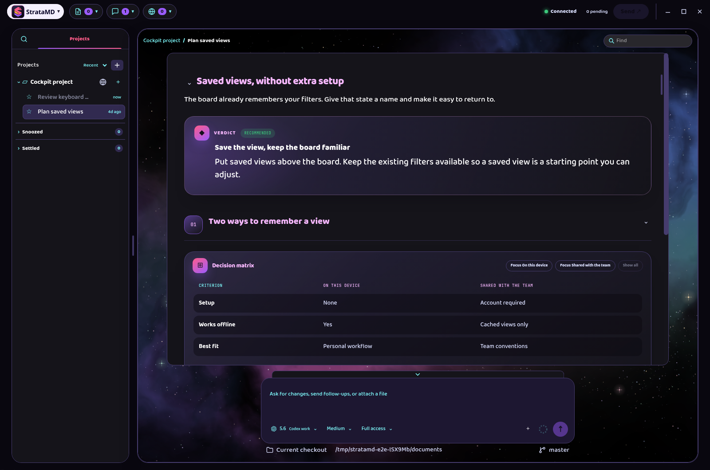
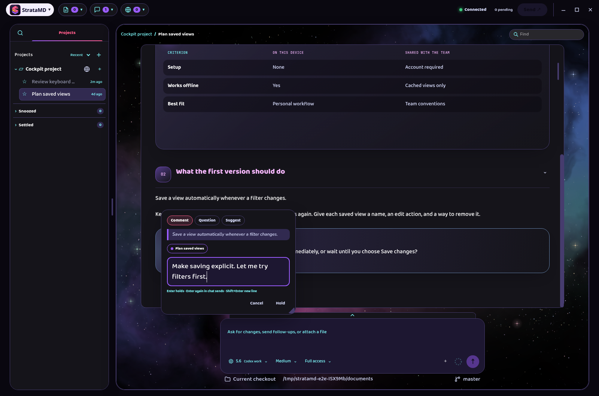
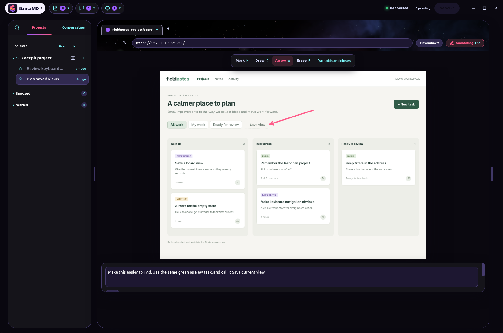

# Strata

Strata is my T3 replacement and the app I use for all of my agent work. I develop software here, work through ideas with AI, and keep changing the app as I find better ways to do both.

This is a solo personal project. It's open source because I think it's cool, useful, and way prettier. Maybe someone else will too.

## What I wanted

Agent output that's easier to read. Feedback that's easier to give. A workspace I actually like looking at.

Strata renders rich replies and documents, including tables, diagrams, charts, and structured cards. You can comment on an exact passage, annotate a plan, and review changes where they happen. The context goes with your feedback, so you spend less time prompting around the thing you meant to point at.

That was what the original document editor did well. Strata takes it into the conversations and the rest of my agent workflow, with projects, terminals, and a built-in browser in the same app.

The browser lets you open what you're building and mark up the page for the agent. Screenshots, comments, and context about the marked elements travel together.

*Real Strata windows. Fictional test data.*

## Built with the T3 server

Strata is an independent app, not a T3 fork. It packages the official [T3 server](https://github.com/pingdotgg/t3code) as its agent engine. T3 handles sessions, provider connections, and agent execution; Strata provides its own desktop interface and interaction tools.

The bundled server runs locally in a separate Strata data directory, and Strata can also connect to an external T3 server. T3 deserves credit for that engine. Replacing the app I use doesn't mean replacing the server underneath it. [Packaging details and current limitations](../../packaging/engine/README.md).

## Use it if you like it

I intend to keep improving Strata because it's the tool I use. Its direction follows my own work and taste.

If you want to get started or aren't sure how something works, give your agent this repository and ask. The [project documentation](../PRD.md) and [agent instructions](../../skills/README.md) cover the details.

We're dropping the MD from the name. Some commands, paths, and older docs still say `stratamd` for now.

[MIT licensed](../../LICENSE).
