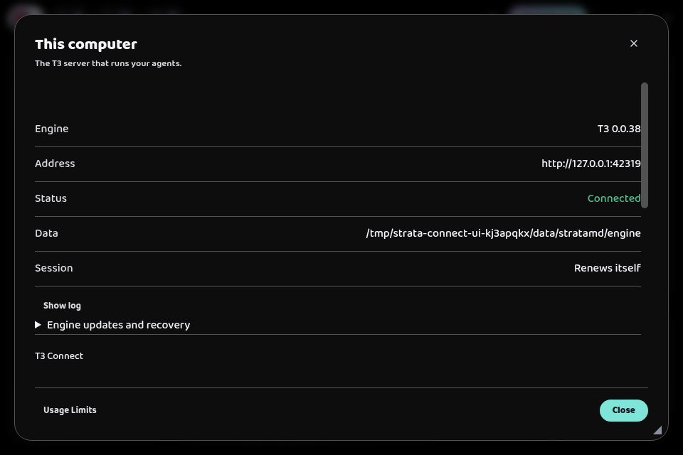
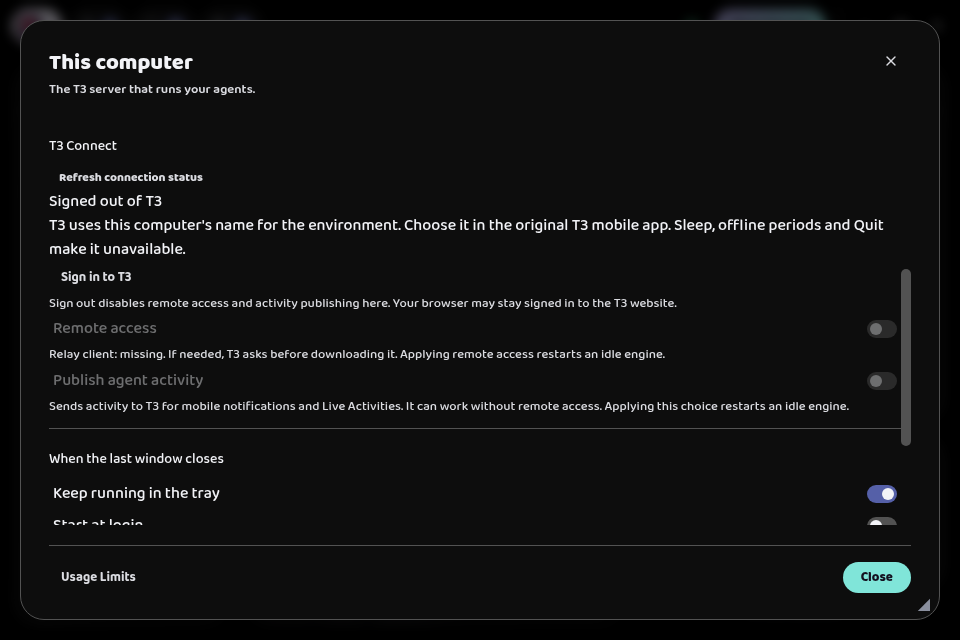

# T3 Connect setup investigation

September 8, 2026. Investigation only. No application changes.

Strata has the basic T3 Connect operations, but it leaves users to discover their order and decide whether setup worked. The largest gaps are a clear entry point, guided authorization, useful progress, and the handoff to the phone. I recommend one **Settings → Connections → Connect this computer** flow.

## What I checked

I inspected Strata at `00fbeeae16d5327a9ef9c0c1b973e30699f7243e`, its bundled T3 0.0.38 executable, and current upstream T3 at `061543e9e5b54ec0048725c37d52fef2962df173`. I opened the existing Strata build with a disposable profile and real bundled engine, inspected the menu and connection screen, and exercised the stock CLI's initial sign-in and relay-download prompts in separate disposable directories.

No hosted account was authorized, no relay was installed, and no phone was connected. Conclusions about those later stages come from source inspection, not a completed remote session. The owner's running app and settings were untouched.

## The complete current flow

| Step | What the user must do | What Strata handles or misses |
| --- | --- | --- |
| 1. Start the host | Open Strata on the computer that will run the agents. | Strata starts its bundled T3 server automatically. Installing a separate T3 desktop app or T3 background service is unnecessary for this path. |
| 2. Find setup | Open the Strata menu, choose **This computer**, then scroll to **T3 Connect**. | **Settings** is a separate dialog with no connection entry. The engine status button also opens This computer. |
| 3. Authorize | Click **Sign in to T3**, sign in through the browser, copy its authorization code, return to Strata, and click **Send to T3**. | Strata forces T3's headless login mode. It automatically opens the printed URL but has no dedicated reopen-browser control. Saving authorization does not enable remote access. |
| 4. Enable remote access | Turn on **Remote access**. If requested, type **yes** into the same field used for the authorization code. | T3 needs its relay client. Strata stops the idle engine before running the command, including the prompt and download, then restarts it. Active conversations block the change. |
| 5. Wait for the connection | Wait for T3 to register the environment and establish its tunnel. | Local engine readiness can precede cloud setup. The screen does not follow cloud setup through a verified completion state. |
| 6. Choose notifications | Optionally enable **Publish agent activity**. | This supports mobile notifications and Live Activities. It is independent of remote access and causes another engine restart in Strata. Mobile permissions also need checking. |
| 7. Connect the phone | Open T3 mobile, sign in to the **same T3 account**, and choose this computer's environment. | Strata mentions choosing the computer name but never displays the name or account identity. It provides no guided phone handoff. |
| 8. Prove it works | Open a conversation on the phone, send a message, and confirm the reply. | Strata has no setup confirmation for this. A saved link is insufficient proof. |
| 9. Keep it available | Leave the computer awake and online. Keep tray mode enabled; choose **Start at login** if access should return after login. | Tray mode defaults on; start at login defaults off. Quit and sleep make the host unavailable. These choices are outside the connection sequence. |

Provider sign-in is separate. A remote connection can work while the selected agent provider still needs setup on the host. T3 mobile accesses the T3 environment and conversations; this is not a promise that it reproduces Strata's document editor and review tools.

T3 Connect, direct network pairing, and switching Strata to an external server solve different problems. The ordinary T3 Connect phone flow does not require configuring LAN access, Tailscale, pairing scopes, or an external server. T3's [remote-access guide](https://github.com/pingdotgg/t3code/blob/061543e9e5b54ec0048725c37d52fef2962df173/docs/user/remote-access.md) describes the account-based and direct-pairing routes separately.

## How T3 handles setup

T3 places connection controls under Settings → Connections. Its current app opens a guided dialog after a new sign-in, offers remote availability and activity publishing together, then advances to connecting devices. The relay download has explicit Cancel and Download and install buttons, with progress stages. Mobile presents the account's environments after sign-in.

The desktop/web controller submits the desired connection and publishing choices through T3's live APIs and refreshes environment discovery. Strata instead drives separate CLI commands and restarts its engine for each configuration change. T3's stock CLI also supports a local browser callback; pasted codes are its headless alternative.

Sources: [T3 onboarding](https://github.com/pingdotgg/t3code/blob/061543e9e5b54ec0048725c37d52fef2962df173/apps/web/src/components/cloud/ConnectOnboardingDialog.tsx), [download dialog](https://github.com/pingdotgg/t3code/blob/061543e9e5b54ec0048725c37d52fef2962df173/apps/web/src/components/cloud/RelayClientInstallDialog.tsx), [connection controller](https://github.com/pingdotgg/t3code/blob/061543e9e5b54ec0048725c37d52fef2962df173/apps/web/src/cloud/useCloudLinkController.ts), [mobile onboarding](https://github.com/pingdotgg/t3code/blob/061543e9e5b54ec0048725c37d52fef2962df173/apps/mobile/src/features/cloud/ConnectOnboardingRouteScreen.tsx). These describe current upstream; compatibility must be checked against Strata's pinned runtime before implementation.

## What should be fixed

### 1. Put setup where users look

Add Connections inside Settings with a prominent **Connect this computer** action. Move engine version, data path, session details, logs, and recovery below the setup into Advanced. The inspected initial window showed the green local **Connected** status while the T3 sign-in button was below the visible area. Label the two states explicitly, such as **Local engine running** and **Remote access off**.

Evidence: [menu](../../src/renderer/components/TopBar.tsx), [Settings](../../src/renderer/components/SettingsDialog.tsx), [This computer](../../src/renderer/components/EngineDialog.tsx), and the captures below.

### 2. Replace the terminal interaction with a guided flow

Use browser sign-in that returns automatically where the stock integration supports it. Keep a distinct **Paste authorization code** fallback. Include **Open browser again**, Cancel, and actionable expired-code errors.

Give the required download its own **Download and continue** button and progress display. Never ask users to interpret terminal output or type yes/no into an authorization field. Do preparation before stopping the engine, and apply remote access and the notification preference together to avoid successive restarts.

Evidence: [Connect wrapper](../../src/main/engine/connect.ts) and [command orchestration](../../src/main/application.ts). The stock CLI's local callback and current T3's live API path are implementation options, not verified drop-in replacements.

### 3. Report the actual result and keep checking until setup settles

There are several distinct issues:

- The real stock download prompt returns exit code zero when the user declines. Strata treats zero as **T3 Connect command finished**. Show **Setup cancelled. Remote access is off** instead.
- **Waiting for T3 authorization** also covers saved authorization with registration still pending. It can direct users back to sign-in when the actual work is server startup or cloud registration.
- T3 provisions cloud access in the background. Strata's local engine readiness check does not prove that finished, and periodic UI polling runs only while its CLI job is running. A later cloud success or failure can remain undisplayed until focus, reopening, or manual refresh.
- The remote switch uses T3's `managedTunnelActive` field. In the bundled server that field means stored endpoint configuration exists, not that a phone successfully reached the host.

Show specific states such as Signing in, Installing connection support, Starting remote access, Connection failed, and Ready to connect a device. Preserve the requested on/off choice during progress. Use a real remote check or observed device session before claiming verified access. Surface account-limit, expired-authorization, and network errors with their corresponding recovery action.

Evidence: [UI polling and labels](../../src/renderer/components/ComputerControls.tsx), [exit handling](../../src/main/engine/connect.ts), [engine readiness](../../src/main/engine/manager.ts), bundled T3 `readCloudLinkState` and `cloudDesiredLinkReconcileLayer`, and [probe results](t3-connect-setup-2026-09-08.evidence/verification.json).

### 4. Complete the phone handoff

Show the actual computer name and signed-in account, then give the exact next step on T3 mobile. Strata already returns `environmentName` but never renders it. Tell users to use the same account on both devices, offer a refresh/check action, and show a connected device when one arrives.

Keep **Mobile notifications** optional and explain their effect. Include the tray and start-at-login choices in setup, with the current settings preserved. Finish with a real conversation check rather than a generic command-completed message.

Evidence: [computer response](../../src/main/application.ts), [controls](../../src/renderer/components/ComputerControls.tsx), [defaults](../../src/main/settings.ts).

### 5. Make account recovery do what the button promises

**Sign in to T3 again** runs ordinary login. The bundled CLI reuses an existing unexpired credential, so that button does not necessarily open sign-in or change the account. Stored-credential status also does not validate that the server still accepts it.

Provide deliberate **Reconnect account** and **Change account** behavior. When recovery requires restarting the host, make that part of the recovery action after active work finishes. The current login action deliberately avoids restart, which is appropriate for first sign-in but insufficient for every failed cloud-startup case.

Evidence: bundled T3 `authorizeCli`, `getExistingNoLock`, and `hasCredential`; [Strata login dispatch](../../src/main/application.ts); [upstream recovery instructions](https://github.com/pingdotgg/t3code/blob/061543e9e5b54ec0048725c37d52fef2962df173/docs/user/remote-access.md#t3-connect-troubleshooting). This recovery gap is source-established, not a reproduced account failure.

### 6. Make the alternative pairing route usable

Keep direct pairing under Advanced with an explicit **Connect over a private network** label. When pairing another device, prefer a reachable network address instead of the current loopback-first default. Offer Copy and QR code controls, explain expiry, and give simple device permission presets. Label the separate external-server form **Use another computer to run agents**.

The current route has endpoint selection, eight permission checkboxes, and a selectable text field. Users must already understand which address reaches their computer and how to transfer the link. Those are unnecessary decisions in ordinary T3 Connect setup.

## Recommended replacement flow

1. **Connect this computer.** Explain that agents run here and can be accessed through T3 on another device.
2. **Sign in.** Open the browser, return automatically where supported, and show the account used.
3. **Enable access.** Present any required download and an optional mobile-notifications choice, then apply the choices with visible progress.
4. **Connect your phone.** Show the computer name, same-account instructions, and connection status.
5. **Finish.** Confirm a working device connection and present the background-running choices.

## Verification needed before calling it complete

The existing release checklist still marks hosted sign-in, relay access, Android discovery/conversations/reconnect, and physical-device sleep/wake as open. Existing Connect tests cover a simulated login process and real signed-out/local pairing behavior. They do not establish the hosted phone journey.

Verify fresh sign-in through the actual GUI, download acceptance and refusal, cancellation and resume, same-account discovery, a phone conversation over a different network, expiry and account recovery, host restart, sleep/wake, and notifications with publishing on and off. Include a deliberately failing relay setup so the UI proves it can explain a failure.

Reference: [release checks](../release/bundled-engine.md), [CLI tests](../../test/unit/t3-connect.test.ts), [managed connection integration](../../test/integration/managed-connections.test.ts), [computer controls test](../../test/e2e/computer-controls.spec.ts).

## Captures

Initial dialog. The local engine says Connected while T3 sign-in is farther down.

T3 Connect controls after scrolling.

