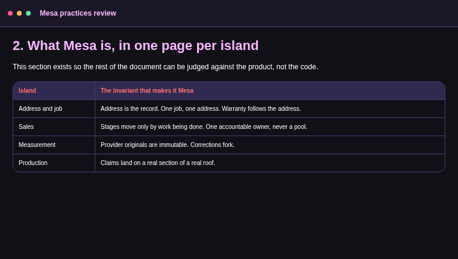

# Component sampler

Every registered component once, with realistic content, for the visual acceptance capture.

## Judgment

<Verdict outcome="recommended">
### Ship registered document components before considering executable MDX

They preserve source identity, keep agents honest, and give the owner one reading grammar.
</Verdict>

<Callout kind="warning">
### Before continuing

Back up the local store before changing its format. The migration rewrites every reading.json file it finds.
</Callout>

<MetricStrip>
- **Open time:** 224 ms
- **Typing:** 9.8 ms
- **Byte drift:** 0
- **Sections reviewed:** 9 of 12
</MetricStrip>

## Work

<PhaseBoard>
### Now

- Fix integration migration ordering and get one green run. *1 day · Tests*
- Wire deploys to green CI. *0.5 day · Owner decision*

### Next

- Add guard triggers to ten core tables. *3 days · Ownership*
- Build the islands manifest and check script. *3 days · Ownership*

### As touched

- Consolidate write modules one island at a time. *30 days · Architecture*
- Walk the product map by island. *Your interview time*
</PhaseBoard>

## Comparison

<DecisionMatrix>
| Criterion | SQLite | Postgres | DuckDB |
|---|---|---|---|
| Setup | Strong | Partial | Strong |
| Portability | Strong | Strong | Partial |
| Concurrency | Weak | Strong | Weak |
</DecisionMatrix>

<BeforeAfter>
> ### Before
> - Copy the document into chat
> - Wait for a full rewrite
> - Compare versions manually

> ### With StrataMD
> - Attach to the open document
> - Discuss changes in place
> - Keep or revert each change
</BeforeAfter>

<Chart kind="bar">
| Stage | Seconds |
|---|---:|
| Typecheck | 8 |
| Unit tests | 19 |
| Build | 13 |
| End-to-end | 34 |
</Chart>

## Evidence

<EvidenceChain>
### Claim

Mesa's written process is upside down.

### Evidence

- [08 §2.3](./evidence.md#defects) — canon caught none of the major August defects.
- [01 §2](./evidence.md#read-path) — the mandated read path costs about 43,000 tokens.
- [03 §0](./evidence.md#ci) — CI stayed red while every push still deployed.

### Therefore

Move invariants into database guards, launchers, and CI.
</EvidenceChain>

<AnnotatedScreenshot>

| Pin | X | Y | Image version | Note |
|---:|---:|---:|---|---|
| 1 | 92.0 | 14.0 | 0:0 | The heading and setup need a clearer visual break. |
| 2 | 22.0 | 52.0 | 0:0 | Long rows blend together and hide each island. |
| 3 | 90.0 | 84.0 | 0:0 | Which invariant should be challenged first? |
</AnnotatedScreenshot>
